# Sistema de Registro de Calificaciones — Documento Técnico de Verificación y Validación de Software

**Portada**

| Campo | Detalle |
|---|---|
| **Proyecto** | Sistema de Registro de Calificaciones — Unidad Educativa (UTEQ) |
| **Materia** | Verificación y Validación de Software |
| **Universidad** | Universidad Técnica Estatal de Quevedo (UTEQ) |
| **Integrantes** | Castro Espinoza Kevin Moisés · Vélez López Ricardo Elías |
| **Docente** | Ing. Cordero Bazurto José Steven |
| **Fecha** | Septiembre 2026 |
| **Versión** | 1.0 |

---

# Índice general

1. Presentación del proyecto y marco teórico
2. Metodología y plan de pruebas
3. Técnica Personas
4. Historias de usuario y criterios de aceptación
5. Casos de prueba manuales
6. Automatización de pruebas (API y UI)
7. Casos de prueba de aceptación del usuario (UAT)
8. Prueba de la versión Beta
9. Registro de observaciones de la Beta
10. Encuesta de satisfacción
11. Métricas del proceso de V&V
12. Resumen de hallazgos y correcciones
13. Conclusiones y recomendaciones
14. Anexos

**Índice de figuras**

- Figura 1. Arquitectura en tres capas del sistema.
- Figura 2. Perfil de los encuestados (N = 30).
- Figura 3. Satisfacción por pregunta (Bloque A, Likert 1–5).
- Figura 4. Resultados del Bloque B (Sí/No).
- Figura 5. Métricas de ejecución de casos de prueba.
- Figuras 6–14. Capturas de pantalla de los casos de prueba manuales (CP-01, CP-02, CP-04, CP-05, CP-08, CP-10, CP-11, CP-13 y CP-14).
- Figuras 15–21b. Análisis por módulo: login, estudiantes, calificaciones, consulta del representante, reportes, auditoría y panel de psicóloga.
- Figuras 22–28. Capturas de pantalla de los casos UAT-01 a UAT-07.

**Índice de tablas**

- Tabla 1. Tecnologías por capa del sistema.
- Tabla 2. Roles y usuarios del sistema.
- Tabla 3. Personas y su foco de pruebas.
- Tabla 4. Matriz de trazabilidad historias → pruebas.
- Tabla 5. Resumen de casos de prueba manuales.
- Tabla 6. Clasificación de los 66 checks de API.
- Tabla 7. Distribución de los 35 tests de Playwright.
- Tabla 8. Categorías de hallazgos de la instalación limpia.
- Tabla 9. Resumen de casos UAT.
- Tabla 10. Participantes de la prueba Beta.
- Tabla 11. Condiciones de la prueba Beta.
- Tabla 12. Consolidado de observaciones de la Beta.
- Tabla 13. Perfil de encuestados.
- Tabla 14. Frecuencias Likert (N = 30).
- Tabla 15. Bloque B (Sí/No).
- Tabla 16. Transcripción de respuestas abiertas (P19–P20).
- Tabla 17. Hallazgos H1–H15 y correcciones.
- Tabla 18. Métricas del proceso de V&V.

---

# 1. Presentación del proyecto y marco teórico

## 1.1 Problema

En la Unidad Educativa, el registro de calificaciones se realizaba mediante planillas físicas y archivos Excel distribuidos por correo electrónico. Este esquema de trabajo presentaba múltiples limitaciones:

- **Pérdida de trazabilidad:** cualquier persona podía corregir una nota a mano sin dejar registro del cambio ni del responsable.
- **Demoras en el cálculo de promedios:** los docentes sumaban y promediaban de forma manual, con errores frecuentes de digitación.
- **Riesgo de inconsistencia:** coexistían varias versiones de la planilla (una por docente y por parcial), sin un control único de la información.
- **Dificultad de acceso para los representantes:** las familias debían acudir físicamente al plantel para conocer las notas de sus hijos.
- **Ausencia de control por rol:** cualquier docente podía ver o modificar información ajena, lo que rompía la confidencialidad académica.

Por ello se desarrolló un **sistema web de registro y consulta de calificaciones**, que además debía ser sometido a un proceso formal de **verificación y validación (V&V)** antes de su puesta en producción. Este documento describe dicho proceso: las técnicas aplicadas, la instrumentación de las pruebas (manuales, automatizadas y de aceptación), los resultados obtenidos y las correcciones realizadas.

## 1.2 Objetivos

### Objetivo general

Verificar y validar el Sistema de Registro de Calificaciones de la Unidad Educativa, garantizando que cumple los requisitos funcionales y de control de acceso definidos y que satisface a los usuarios finales.

### Objetivos específicos

1. Aplicar técnicas de verificación estática y dinámica (revisión de código, pruebas de caja negra por API y pruebas end-to-end por interfaz) sobre el repositorio del sistema.
2. Ejecutar un plan de casos de prueba manuales y automatizados alineado a los requisitos del usuario, con evidencia trazable.
3. Realizar pruebas de aceptación (UAT) y una prueba Beta con usuarios finales simulados según la técnica Personas.
4. Medir la satisfacción del usuario mediante una encuesta estructurada de 20 preguntas aplicada a 30 usuarios.
5. Documentar los hallazgos, corregirlos y verificar su cierre, y emitir conclusiones y recomendaciones.

## 1.3 Alcance y limitaciones

### Alcance

- Gestión de estudiantes, materias, cursos, ciclos, parciales, tipos de calificación y periodos académicos.
- Registro de calificaciones por parte de docentes, con validación de rango 0–10 y autorización por materia asignada.
- Consulta de notas y promedios para representantes (solo sus hijos) y para estudiantes (solo sus propias notas).
- Reportes de promedios por periodo y panel de rendimiento académico para psicóloga.
- Panel de auditoría de cambios (INSERT/UPDATE/DELETE con datos antes/después) y respaldos de base de datos.
- Control de acceso por roles: administrador, profesor, representante, psicóloga y estudiante.

### Limitaciones

- El entorno de pruebas es de laboratorio: el sistema se ejecuta sobre `localhost` con una base de datos de prueba poblada con datos sintéticos; no se realizaron pruebas de carga masiva sobre infraestructura de producción.
- La prueba Beta se ejecutó con participantes simulados (basados en la técnica Personas) por razones de confidencialidad y disponibilidad; los datos de la encuesta siguen el mismo criterio de simulación con base en los módulos involucrados.
- Las pruebas de compatibilidad se limitaron a los navegadores Chrome y Edge en sistemas de escritorio y a la vista móvil sobre dispositivos de prueba.

## 1.4 Marco conceptual de verificación y validación

Este apartado consolida las definiciones y estándares que orientan el proceso documentado en los siguientes capítulos.

### 1.4.1 Verificación vs. validación

Según el estándar **IEEE Std 1012-2016 (IEEE Standard for System, Software, and Hardware Verification and Validation)**, la verificación y la validación son procesos complementarios:

- **Verificación:** responde a la pregunta "¿estamos construyendo el producto correctamente?". Evalúa que el software cumple especificaciones técnicas, reglas de programación y requisitos de diseño. Incluye técnicas estáticas (revisión de código, inspección de migraciones y procedimientos almacenados) y dinámicas (ejecución de pruebas de API y de interfaz).
- **Validación:** responde a la pregunta "¿estamos construyendo el producto correcto?". Evalúa que el software satisface las necesidades reales del usuario final. Incluye las pruebas de aceptación del usuario (UAT), la prueba Beta y la encuesta de satisfacción.

En este proyecto la **verificación** estuvo dominada por los hallazgos H1–H15 (migraciones, `search_path`, procedimientos almacenados, seeds y scripts), mientras que la **validación** estuvo dominada por los casos UAT, la prueba Beta y la encuesta de satisfacción.

### 1.4.2 Técnicas de prueba aplicadas

1. **Revisión de código e inspección:** revisión de las migraciones SQL (01–21), de los procedimientos almacenados (`sp_registrar_calificacion`, `fn_auditoria_generica`, triggers) y de los scripts de instalación (`setup.ps1`, `seed-test-users.js`). Origen de los hallazgos H1–H15.
2. **Pruebas de caja negra (API):** ejecución de casos sobre `backend/e2e_test.js` (66 checks) validando entradas/salidas HTTP (200, 400, 403, 409), el contenido de las respuestas y las restricciones de negocio.
3. **Pruebas end-to-end (UI):** suite Playwright de 35 tests que reproducen flujos completos del usuario sobre el navegador Chromium.
4. **Pruebas de aceptación del usuario (UAT):** 7 casos basados en las historias de usuario y sus criterios de aceptación.
5. **Prueba Beta:** uso del sistema durante 7 días por 6 usuarios finales simulados.
6. **Encuesta de satisfacción:** instrumento de 20 preguntas en 3 bloques (Likert, Sí/No y abiertas) aplicado a 30 usuarios.

### 1.4.3 Niveles de prueba y su justificación

| Nivel | Objetivo | Activo del sistema | Instrumentos |
|---|---|---|---|
| Estático (revisión) | Detectar defectos de diseño/implementación sin ejecutar | Migraciones, SP, triggers, scripts | Inspección manual, `git diff` |
| Integración (API) | Validar contratos y reglas de negocio | Rutas Express + PostgreSQL | `backend/e2e_test.js` |
| Sistema (UI) | Validar flujos completos del usuario | Interfaz web + API | Playwright |
| Aceptación | Confirmar que el usuario logra sus tareas | Sistema completo | Casos UAT + Beta + encuesta |

### 1.4.4 Criterios de aceptación y trazabilidad

Cada requisito se expresó como **historia de usuario (HU)** con **criterios de aceptación (CA)** verificables. Los casos de prueba manuales (CP), automatizados (AUT) y de aceptación (UAT) referencian directamente el código HU/CA, lo que permite la **matriz de trazabilidad** del Capítulo 4 y cumplir el criterio de auditoría del proceso.


### 1.4.5 Modelo de calidad ISO/IEC 25010 aplicado

El plan de pruebas se organizó considerando las características de calidad del estándar **ISO/IEC 25010**, de modo que cada actividad de verificación o validación responda a una característica medible:

| Característica ISO 25010 | ¿Qué se verificó en el sistema? | Instrumento |
|---|---|---|
| Adecuación funcional | Cumplimiento de los 9 requisitos (HU) y sus criterios | CP, API, UI, UAT |
| Corrección | Cálculo de promedios y fórmula oficial (80/20) | CP-05/09, checks API, pruebas manuales |
| Fiabilidad | Ausencia de fallos en la prueba Beta y 0 errores bloqueantes | Beta + encuesta P16 |
| Usabilidad | Facilidad de uso y aprendizaje (P1, P2, P13) | Encuesta Likert |
| Eficiencia de rendimiento | Tiempo de respuesta percibido y suites < 90 s | Encuesta P4, tiempos de ejecución |
| Seguridad | Control de acceso por rol, 403, bcrypt, cookie firmada | CP-07/11, checks API |
| Mantenibilidad | Código estructurado por capas, migraciones versionadas | Revisión estática |
| Portabilidad | Ejecución reproducible en instalación limpia | Reconstrucción de BD, suites |

### 1.4.6 Técnicas de caja negra y caja blanca aplicadas

- **Caja negra (comportamiento):** se probaron entradas y salidas a través de la API y de la interfaz sin conocer la implementación interna. Destacan las **particiones de equivalencia** (nota válida 0–10 vs. inválida 11; cédula única vs. duplicada; periodo con fechas coherentes vs. invertidas) y los **valores límite** (nota = 0 y nota = 10 como extremos aceptados, 11 y -1 como rechazados; página = 10 elementos por página). Ejemplos de ejecución: CP-03, CP-06, CP-07, CP-09, CP-12.
- **Caja blanca (estructura):** se revisaron los procedimientos almacenados (`sp_registrar_calificacion`), el trigger `fn_auditoria_generica`, los índices (parcial sobre `activo`) y las rutas del backend. Esta técnica originó los hallazgos H5, H6 y H10.

El uso combinado de ambas técnicas aumentó la confianza: la caja negra confirmó el comportamiento esperado por el usuario, y la caja blanca garantizó que las reglas de integridad vivieran tanto en la API como en la base de datos.

### 1.4.7 Modelo en V aplicado al proceso

El proceso siguió un esquema tipo **modelo en V**, vinculando cada nivel de verificación con su contraparte de validación:

| Verificación (lado izquierdo) | Nivel | Validación (lado derecho) |
|---|---|---|
| Revisión de requisitos y criterios | Requisitos | Casos UAT (7/7) |
| Revisión de diseño (migraciones, SP, rutas) | Diseño | Encuesta de satisfacción |
| Pruebas de integración de componentes | Integración | Suite de API (66/66) |
| Pruebas de sistema | Sistema | Suite de UI (35/35) + prueba Beta |

### 1.4.8 Fórmula oficial y escala cualitativa

El sistema calcula el promedio de cada materia con la **fórmula oficial institucional**: el **80%** corresponde a la sumatoria ponderada de los parciales (según los pesos de los ciclos) y el **20%** al examen final. Sobre el promedio se aplica la escala cualitativa:

| Promedio | Escala cualitativa |
|---|---|
| 9.00 – 10.00 | Domina los aprendizajes requeridos |
| 7.00 – 8.99 | Alcanza los aprendizajes requeridos |
| 4.01 – 6.99 | Próximo a alcanzar los aprendizajes requeridos |
| ≤ 4.00 | No alcanza los aprendizajes requeridos |

Esta escala se validó en el CP-09 (reportes) y se mostraba en la consulta del representante (UAT-04). Las notas ingresadas por el docente solo se aceptan en el rango 0–10, con dos decimales, y cualquier valor fuera de ese rango es rechazado por la API y por el trigger de base de datos (CP-06).

## 1.5 Arquitectura y tecnologías del sistema

**Tabla 1. Tecnologías por capa del sistema.**

| Capa | Tecnología |
|---|---|
| Frontend | HTML5, CSS3 y JavaScript nativo en `frontend/` |
| Backend | Node.js + Express (carpeta `backend/`, puerto 3000) |
| Base de datos | PostgreSQL 18 · esquema `colegio` · `search_path = colegio, public` |
| Seguridad | bcrypt (hash de contraseñas), sesiones con cookie firmada, middleware de sesión y autorización por rol |
| Control de acceso | Middleware que valida rol por ruta (administrador, profesor, representante, psicóloga, estudiante) |
| Auditoría | Trigger genérico `fn_auditoria_generica` que registra antes/después en JSONB con el usuario de la aplicación |
| Automatización | Playwright (`@playwright/test` 1.63) para UI + script `backend/e2e_test.js` para API |
| Respaldos | `pg_dump` invocado desde el backend + programación con `node-cron` |

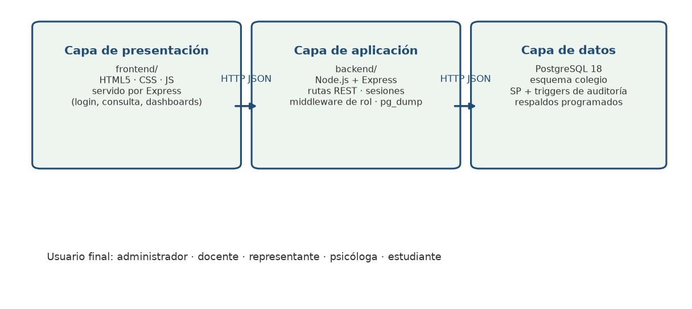

## 1.6 Usuarios y datos de prueba

**Tabla 2. Roles y usuarios del sistema.**

| Rol | # usuarios | Descripción |
|---|---|---|
| administrador | 1 | Gestión de catálogos, estudiantes, periodos, auditoría y respaldos |
| profesor | 5 | Registro de calificaciones de las materias asignadas |
| representante | 1 | Consulta de las notas de sus hijos |
| psicologo | 1 | Panel de rendimiento académico y alertas |
| estudiante | 1 | Consulta de sus propias notas (sin reportes ni datos ajenos) |

El conjunto de datos de prueba está compuesto por **110 estudiantes** (10 del seed inicial `06_more_data.sql` más 100 sintéticos generados por la migración `19_datos_sinteticos.sql`) a los que se suman los registros que los propios casos de prueba crean y limpian (la corrida de evidencias mostró hasta 139 estudiantes y 124 filas de nómina al momento de la captura). El **periodo activo** es el id 1 ("2026-2027 · Primer Quimestre"), con ciclos "Quimestre 1" y parciales "Parcial 1". Se dispone además de 5 bloques materia+paralelo y de un representante con 15 hijos, datos utilizados por los casos automatizados.

---# 2. Metodología y plan de pruebas

## 2.1 Enfoque y fases

El proceso de V&V se ejecutó en fases, alineadas con el **Plan de Mejoras v2** del repositorio (Fases 1–8). Cada fase combinó una tarea de verificación con una de validación:

| Fase | Actividad de verificación | Actividad de validación | Resultado |
|---|---|---|---|
| 1 | Revisión del esquema de base de datos y migraciones (01–21) | Definición de las historias de usuario HU-01…HU-09 | Corrección de migraciones (H1–H6) |
| 2 | Revisión de rutas, middleware y procedimientos almacenados | Definición de criterios de aceptación por HU | Corrección de `search_path` y SP (H5, H6, H10) |
| 3 | Ejecución de pruebas de API (`e2e_test.js`) | Comparación de resultados contra los criterios | 66/66 API PASS |
| 4 | Ejecución de pruebas de UI (Playwright) | Observación del comportamiento del flujo real | 35/35 UI PASS |
| 5 | Revisión de seeds y datos de prueba | Población y consulta de datos por rol | Remapeo de profesores y representante (H13, H14) |
| 6 | Pruebas de aceptación (UAT) | Juicio del usuario final simulado | 7/7 UAT ACEPTADO |
| 7 | Prueba Beta (7 días) | Uso real por 6 participantes | 0 errores funcionales |
| 8 | Encuesta de satisfacción | Percepción de 30 usuarios | 4.7/5 (94%) |

## 2.2 Estrategia de prueba por nivel

1. **Nivel estático:** inspección de código fuente, migraciones SQL y scripts de instalación. Fundamentalmente se revisaron:
   - Las migraciones `0N_*.sql` y la secuencia `01`–`21` (rollout ordenado).
   - Los procedimientos almacenados y triggers (auditoría, registro de calificaciones, ponderación de ciclos).
   - Los scripts `setup.ps1`, `seed-test-users.js` y `e2e_test.js`.
2. **Nivel de integración/API:** se ejecutó el script `backend/e2e_test.js` (66 checks) que golpea las rutas REST con credenciales por rol y verifica en la base de datos el resultado de cada operación.
3. **Nivel de sistema/UI:** se ejecutó la suite Playwright (35 tests) sobre Chromium, con la base de datos compartida en ejecución serializada (workers = 1).
4. **Nivel de aceptación:** casos UAT (7), prueba Beta (7 días) y encuesta (30 usuarios).

## 2.3 Entorno de pruebas

| Elemento | Valor |
|---|---|
| Sistema operativo | Windows / Linux (desarrollo) |
| Servidor local | API + frontend servidos por Express en `http://localhost:3000` |
| Base de datos | PostgreSQL 18, esquema `colegio` |
| Navegador de pruebas | Chromium (Chrome for Testing v153, del instalador de Playwright 1.63) |
| Navegadores de compatibilidad | Chrome y Edge (Beta) |
| Node.js | v24 |
| Editor / control de versiones | VSCode · Git + GitHub |

## 2.4 Datos de prueba

Los datos provienen de las migraciones del repositorio:

- **10 estudiantes** del seed base `06_more_data.sql`, con sus profesores, asignaciones y notas iniciales.
- **100 estudiantes sintéticos** añadidos por `19_datos_sinteticos.sql` (para ejercer paginación y reportes).
- **Periodos:** 3 (activo = id 1 "2026-2027 · Primer Quimestre"), con ciclos y parciales.
- **5 bloques** materia+paralelo usados por la consulta por bloques y por las asignaciones.
- El **rol estudiante** (migración 21) permite a un alumno consultar únicamente sus propias notas.

Además, la suite automatizada **descubre los identificadores en tiempo de ejecución** (no los hardcodea) y **limpia los objetos E2E-\*** que crea, de modo que la base permanece coherente entre corridas.

## 2.5 Criterios de entrada y salida

### Criterios de entrada

- El repositorio está actualizado a `origin/main` con las migraciones 01–21 aplicadas.
- La base de datos está reconstruible desde cero (`psql` + migraciones) y contiene el periodo activo.
- El servidor se levanta con `npm start` y responde en el puerto 3000.
- Como verificación de entorno, el login de los 4 roles principales completa con 200 OK.

### Criterios de salida

- 100% de los casos manuales (14/14), API (66/66), UI (35/35) y UAT (7/7) superados.
- Cero hallazgos abiertos de severidad alta o media.
- No se reportan errores funcionales en la prueba Beta.
- Satisfacción global de la encuesta ≥ 4.5/5.

## 2.6 Roles, responsables y cronograma

| Rol en el proceso | Responsable | Actividades |
|---|---|---|
| Analista de V&V / tester de API | Vélez López Ricardo | Pruebas de API, entorno, evidencias, hallazgos H1–H15 |
| Tester de UI / documentación | Castro Espinoza Kevin Moisés | Suite Playwright, capturas, UAT, encuesta |
| Usuario final simulado (Beta) | Participantes B1–B6 | Prueba Beta y encuesta |

| Actividad | Semana 1 | Semana 2 | Semana 3 | Semana 4 |
|---|---|---|---|---|
| Revisión estática y corrección de hallazgos | X | X | | |
| Pruebas de API | X | X | X | |
| Pruebas de UI (Playwright) | | X | X | |
| UAT | | | X | X |
| Prueba Beta (7 días) | | | | X |
| Encuesta y análisis | | | | X |
| Elaboración del informe final | | | X | X |

## 2.7 Riesgos y su mitigación

| Riesgo | Impacto | Mitigación aplicada |
|---|---|---|
| Migraciones que fallan en instalación limpia | Bloqueo del entorno | Revisión estática H1–H6 y reconstrucción de base desde cero |
| Rutas que llaman a SP inexistentes o ambiguos | 500 en calificaciones | Corrección de llamadas H6 y H10 |
| Búsquedas con `search_path` incorrecto | "relación no existe" | `ALTER DATABASE/ROLE ... SET search_path TO colegio, public` (H5, H12, H15) |
| Seeds con profesores desalineados | Dashboard vacíos | Remapeo por email (H13, H14) |
| Suite frágil por IDs hardcodeados | Falsos negativos | Reescritura data-driven de `e2e_test.js` (H7) |
| Playwright sin navegador en CI/local | Suite caída | Instalación de Chromium v1243 (H8) |

## 2.8 Herramientas de apoyo

| Herramienta | Uso |
|---|---|
| `@playwright/test` 1.63 | Orquestación de pruebas E2E, reporter de lista y HTML |
| Node.js (fetch/axios) | Pruebas de API en `e2e_test.js` |
| Chromium headless | Ejecución de capturas y de la suite UI |
| Git / GitHub | Control de versiones, revisión de cambios entre commits (origen de H1–H15) |
| python-docx + Chromium print | Generación de los artefactos finales (PDF y DOCX) del informe |
| matplotlib | Gráficos de resultados de la encuesta y métricas |
| Google Forms (simulado) | Instrumento de la encuesta de satisfacción |

---# 3. Técnica Personas

## 3.1 Justificación de la técnica

La técnica **Personas** consiste en crear arquetipos de usuarios finales basados en datos realistas (edad, rol, escolaridad, experiencia tecnológica, objetivos y frustraciones) para guiar el diseño de producto y, en este caso, **orientar el diseño de las pruebas**. Se definieron cuatro personas que representan los perfiles que interactúan con el sistema, cada una con un **foco de pruebas** distinto: el control administrativo, la carga de notas, la consulta remota y el análisis de rendimiento.

## 3.2 Persona 1 — "Lic. Moisés Panamá" (Administrador / Coordinador Académico)

| Atributo | Detalle |
|---|---|
| Edad | 35 años |
| Rol | Coordinador Académico de la Unidad Educativa |
| Escolaridad | Licenciado en Ciencias de la Educación |
| Experiencia tecnológica | Media: ofimática, correo y sistemas web institucionales |
| Entorno | Computadora de escritorio en la administración |

**Objetivos:**
- Tener un control centralizado y trazable de estudiantes, materias, periodos académicos y calificaciones.
- Garantizar la integridad de la información: que nadie altere una nota sin dejar registro.
- Generar reportes oficiales de promedios por periodo para la dirección.

**Necesidades:**
- Crear y mantener el catálogo de estudiantes, materias y periodos.
- Asignar y activar **un único periodo académico** en uso.
- Auditar cualquier cambio de los docentes y propios.
- Respaldar la base de datos para evitar pérdida de información.

**Frustraciones:**
- Teme que un docente modifique notas en papel sin dejar rastro.
- Le incomodan los Excel compartidos porque pierden la trazabilidad.
- El cambio de periodo debe ser sencillo y seguro (solo un activo a la vez).

**Relación con el sistema:** utiliza la gestión de estudiantes, materias, periodos, auditoría y respaldos. Orienta la prioridad de las historias de administración, control de acceso y auditoría (HU-01, HU-02, HU-06, HU-07, HU-08) y de los casos CP-01…CP-04, CP-10…CP-12.

## 3.3 Persona 2 — "Prof. Elena Romero" (Docente)

| Atributo | Detalle |
|---|---|
| Edad | 29 años |
| Rol | Profesora de Ciencias Naturales (Octavo EGB) |
| Escolaridad | Ing. en Ciencias Naturales |
| Experiencia tecnológica | Media-alta: Moodle, Google Classroom |
| Entorno | Laptop personal, internet del plantel |

**Objetivos:**
- Registrar las calificaciones de sus estudiantes de forma rápida y sin errores de cálculo.
- Ver únicamente las notas de las materias que le corresponden.
- Confiar en que el promedio se calcula con la fórmula oficial (80% parciales + 20% examen).

**Necesidades:**
- Entrar al módulo "Registrar Nota" y ver su materia asignada.
- Digitar notas parciales y guardarlas en masa (tabla completa).
- Corregir una nota (upsert) con la seguridad de que el cambio queda auditado.
- Consultar las notas ya registradas del periodo.

**Frustraciones:**
- En libros físicos pierde tiempo sumando promedios a mano.
- Le preocupa equivocarse de estudiante al llenar la planilla.

**Relación con el sistema:** protagonista de las historias de registro de calificaciones (HU-03) y de las validaciones de rango 0–10 y asignación de materia (un profesor solo califica sus materias). Ejercida en los casos CP-05…CP-07 y los tests automatizados de `calificaciones.spec.cjs`.

## 3.4 Persona 3 — "Sr. Fernando Castillo" (Representante / Padre de familia)

| Atributo | Detalle |
|---|---|
| Edad | 41 años |
| Rol | Representante legal de un estudiante de Octavo EGB |
| Escolaridad | Bachiller |
| Experiencia tecnológica | Baja-media: redes sociales, WhatsApp, portales web |
| Entorno | Móvil o computador familiar |

**Objetivos:**
- Consultar las notas de sus hijos sin acudir al plantel.
- Ver los promedios por materia y el promedio general de cada periodo.
- Identificar a tiempo si su representado está en riesgo académico.

**Necesidades:**
- Ingresar con un usuario propio (sin permisos de administración).
- Ver **solo** la información de sus hijos.
- Navegación simple: seleccionar el hijo y ver el cuadro de notas y promedios.

**Frustraciones:**
- Los formatos impresos se pierden en la mochila.
- No entiende los promedios sin una escala clara.

**Relación con el sistema:** valida la historia de consulta de notas (HU-04) y el control de visibilidad por rol; fue usuario clave de la prueba Beta (B1).

## 3.5 Persona 4 — "Lic. María Torres" (Psicóloga Educativa / DECE)

| Atributo | Detalle |
|---|---|
| Edad | 33 años |
| Rol | Psicóloga del Departamento de Consejería Estudiantil |
| Escolaridad | Licenciada en Psicología Educativa |
| Experiencia tecnológica | Media: sistemas de reportes institucionales |
| Entorno | Computadora del DECE |

**Objetivos:**
- Identificar estudiantes con bajo rendimiento o riesgo académico para intervención temprana.
- Ver el desempeño por quimestre y por materia de forma agregada.
- Preparar listados de estudiantes que requieren acompañamiento.

**Necesidades:**
- Pantalla de "Rendimiento" con resumen de alertas.
- Detalle por estudiante con promedios por materia y por periodo.
- Solo lectura de indicadores (no modifica notas).

**Frustraciones:**
- Antes dependía de capturas que le pasara el docente.
- Necesita datos objetivos, no impresiones.

**Relación con el sistema:** valida el módulo de rendimiento académico (HU-09) tanto en las pruebas automatizadas como en las UAT (CP-13, `psicologo.spec.cjs`, UAT-07).

## 3.6 Cómo orientaron las personas el diseño de las pruebas

| Persona | Foco de pruebas resultante |
|---|---|
| Moisés (admin) | Gestión de estudiantes/materias/periodos, activación de un solo periodo, panel de auditoría y respaldos → HU-01, HU-02, HU-06, HU-07, HU-08 |
| Elena (profesor) | Validaciones de rango (0–10), autorización por materia, guardado masivo → HU-03 |
| Fernando (representante) | Consulta con restricción por rol, legibilidad de promedios y escala cualitativa → HU-04, HU-05 |
| María (psicóloga) | Panel de rendimiento, alertas y detalle por estudiante → HU-09 |

Estas personas permitieron derivar historias de usuario reales y definir **criterios de aceptación orientados a la frecuencia y al valor de uso de cada perfil**, como los que se detallan en el capítulo siguiente.

---

# 4. Historias de usuario y criterios de aceptación

## 4.1 Formato

Las historias usan el formato estándar **"Como [rol], quiero [funcionalidad], para [beneficio]"**, acompañadas de criterios de aceptación verificables. Cada historia tiene un código **HU-XX** que se usa como referencia en los casos de prueba manuales (CP), automatizados (AUT) y de aceptación (UAT).

## 4.2 HU-01 — Iniciar sesión (administrador)

**Como** administrador, **quiero** iniciar sesión con mi correo y contraseña, **para** acceder a la gestión del sistema.

**Criterios de aceptación:**
1. CA-1: Con credenciales válidas, el usuario es redirigido al dashboard.
2. CA-2: Con contraseña incorrecta, se muestra un mensaje de error y no se inicia sesión.
3. CA-3: Solo los usuarios con `activo = true` pueden ingresar.

**Evidencia de cumplimiento:** CP-01, CP-02, CP-14; AUT-01, AUT-02, AUT-09; UAT-01; 5 logins por rol en la suite API.

## 4.3 HU-02 — Gestión de estudiantes

**Como** administrador, **quiero** registrar, listar y buscar estudiantes, **para** mantener el registro de matrícula actualizado.

**Criterios de aceptación:**
1. CA-1: Se crea un estudiante con cédula única, nombres, apellidos, fecha de nacimiento y representante.
2. CA-2: La búsqueda por cédula o nombre devuelve las coincidencias.
3. CA-3: Una cédula duplicada es rechazada con mensaje claro (HTTP 409).

**Evidencia de cumplimiento:** CP-03, CP-04; AUT-03, AUT-04; UAT-02; checks de paginación de la suite API (139 estudiantes).

## 4.4 HU-03 — Registro de calificaciones (profesor)

**Como** profesor, **quiero** registrar las notas de mis estudiantes en las materias que tengo asignadas, **para** que el promedio se calcule automáticamente.

**Criterios de aceptación:**
1. CA-1: El profesor solo ve y edita calificaciones de materias asignadas en el periodo activo.
2. CA-2: Las notas deben estar en el rango 0–10; valores fuera de rango se rechazan.
3. CA-3: El guardado masivo registra todas las celdas modificadas en una sola transacción.
4. CA-4: Si cambia una nota existente, se sobrescribe (upsert) y el cambio queda auditado.
5. CA-5: El profesor no puede registrar notas de una materia que no tiene asignada (HTTP 403).

**Evidencia de cumplimiento:** CP-05, CP-06, CP-07; AUT-05; checks de calificaciones de la suite API (lote con parcial/ciclo, parcial inválido → 400).

## 4.5 HU-04 — Consulta de calificaciones por estudiante

**Como** representante, **quiero** consultar las notas y promedios de mis hijos, **para** dar seguimiento a su rendimiento académico.

**Criterios de aceptación:**
1. CA-1: El representante ve únicamente las notas de sus hijos.
2. CA-2: Se muestran las notas por materia, el promedio por materia y el promedio general del periodo.
3. CA-3: Se muestra la escala cualitativa oficial (Domina / Alcanza / Próximo / No alcanza) según el promedio.

**Evidencia de cumplimiento:** CP-08; AUT-06; UAT-04; checks del dashboard de representante (15 hijos con promedios) y del desglose por materia.

## 4.6 HU-05 — Reportes de promedios por periodo

**Como** representante y administrador, **quiero** ver el reporte de promedios del periodo, **para** conocer el desempeño general del curso.

**Criterios de aceptación:**
1. CA-1: El reporte lista estudiantes ordenados por promedio descendente.
2. CA-2: Se puede filtrar por curso y por materia.
3. CA-3: El promedio mostrado coincide con la fórmula oficial del sistema.

**Evidencia de cumplimiento:** CP-09; UAT-05; checks de paginación de la suite API (reportes con 124 filas y filtro sin-curso).

## 4.7 HU-06 — Auditar cambios (administrador)

**Como** administrador, **quiero** consultar el historial de cambios, **para** garantizar la integridad y trazabilidad de la información.

**Criterios de aceptación:**
1. CA-1: Solo el rol administrador puede acceder al panel de auditoría.
2. CA-2: Se registran INSERT, UPDATE y DELETE con datos antes/después en JSONB.
3. CA-3: Cada registro indica el usuario de la aplicación que realizó el cambio.
4. CA-4: La tabla `auditoria` es de solo lectura + inserción (nadie modifica el historial).

**Evidencia de cumplimiento:** CP-10, CP-11; AUT-03, AUT-07; UAT-06; checks de auditoría de la suite API (total 855 registros en la corrida, usuario de la app, resumen por categorías, filtros y 403 para Elena).

## 4.8 HU-07 — Activación de un único periodo académico

**Como** administrador, **quiero** activar un periodo académico y que exista solo uno activo, **para** que todas las operaciones operen sobre el periodo correcto.

**Criterios de aceptación:**
1. CA-1: Solo puede existir un periodo con `activo = TRUE` (reforzado por índice parcial y trigger).
2. CA-2: Al activar un nuevo periodo, los anteriores quedan inactivos automáticamente.

**Evidencia de cumplimiento:** CP-12; revisión estática del índice parcial y del trigger; chequeo del periodo activo id=1 en la suite API.

## 4.9 HU-08 — Respaldo de la base de datos

**Como** administrador, **quiero** crear y programar respaldos de la base de datos, **para** prevenir la pérdida de información.

**Criterios de aceptación:**
1. CA-1: Se puede generar un respaldo manual (`pg_dump`) desde el panel.
2. CA-2: Se puede programar un respaldo diario con `node-cron`.
3. CA-3: Los respaldos pueden listarse, descargarse y eliminarse (solo admin).

**Evidencia de cumplimiento:** CP-11 (restricción), AUT-07; checks de respaldos de la suite API (respaldo manual nombrado y historial paginado de 5 filas).

## 4.10 HU-09 — Rendimiento académico (psicóloga)

**Como** psicóloga, **quiero** ver el rendimiento académico y las alertas de bajo desempeño, **para** identificar a los estudiantes que requieren acompañamiento.

**Criterios de aceptación:**
1. CA-1: El panel muestra resumen (total, bajo rendimiento, destacados, promedio general).
2. CA-2: Se listan estudiantes con promedios por quimestre y estado (En Inicio / En Proceso / Logro Esperado / Logro Destacado).
3. CA-3: Un clic en el estudiante abre el detalle con notas por materia y por periodo.

**Evidencia de cumplimiento:** CP-13; AUT-08; UAT-07; checks de la suite API (paginado + resumen con 111 estudiantes y 10 alertas).

## 4.11 Matriz de trazabilidad

**Tabla 4. Matriz de trazabilidad (Historias → Pruebas).**

| Historia | Casos manuales | Casos automatizados UI | Casos UAT |
|---|---|---|---|
| HU-01 Login | CP-01, CP-02, CP-14 | AUT-01, AUT-02, AUT-09 | UAT-01 |
| HU-02 Estudiantes | CP-03, CP-04 | AUT-03, AUT-04 | UAT-02 |
| HU-03 Calificaciones | CP-05, CP-06, CP-07 | AUT-05 | UAT-03 |
| HU-04 Consulta | CP-08 | AUT-06 | UAT-04 |
| HU-05 Reportes | CP-09 | — | UAT-05 |
| HU-06 Auditoría | CP-10, CP-11 | AUT-03, AUT-07 | UAT-06 |
| HU-07 Periodo activo | CP-12 | — | — |
| HU-08 Respaldos | CP-11 | AUT-07 | — |
| HU-09 Psicóloga | CP-13 | AUT-08 | UAT-07 |

---# 5. Casos de prueba manuales

## 5.1 Objetivo y método

Se diseñaron **14 casos de prueba manuales (CP-01 … CP-14)** que cubren transversalmente las 9 historias de usuario. Se ejecutaron dos técnicas:

1. **Pruebas funcionales sobre la interfaz web** (login, dashboards, búsquedas, consultas, auditoría, psicóloga, logout), documentadas con capturas de pantalla.
2. **Pruebas de validación de negocio sobre la API** (409 de cédula duplicada, 400 de nota fuera de rango, 400 de fechas de periodo, 403 de materia no asignada, reportes y auditoría), documentadas en `evidencias/pruebas_api_manuales.txt`.

**Estado global: 14/14 casos ejecutados · 14 PASS · 0 FAIL.**

## 5.2 CP-01 — Login exitoso (administrador)

| Campo | Detalle |
|---|---|
| Historia / Criterio | HU-01 / CA-1 |
| Precondiciones | Usuario `admin@uteq.edu.ec` activo; servidor en `localhost:3000` |
| Datos de prueba | `admin@uteq.edu.ec` / `UTEQ2026` |
| Pasos | 1) Abrir `login.html`. 2) Ingresar correo y contraseña. 3) Enviar el formulario. |
| Resultado esperado | Redirección a `dashboard.html`, saludo "Bienvenido" y rol `administrador` |
| Resultado obtenido | Redirección correcta; `#bienvenida` = "Bienvenido"; `#rol` = administrador |
| Estado | ✅ PASS |


**Verificación adicional:** el mismo flujo se repitió con éxito para los roles profesor, representante y psicóloga (tests AUT-01 del capítulo 6).

## 5.3 CP-02 — Login con contraseña incorrecta

| Campo | Detalle |
|---|---|
| Historia / Criterio | HU-01 / CA-2 |
| Precondiciones | — |
| Datos de prueba | `admin@uteq.edu.ec` / `clave_equivocada` |
| Pasos | 1) Abrir `login.html`. 2) Ingresar correo válido y contraseña inválida. 3) Enviar. |
| Resultado esperado | Mensaje de error visible, sin sesión creada, permanece en login |
| Resultado obtenido | `#error` visible con mensaje de credenciales inválidas; sin redirección |
| Estado | ✅ PASS |


## 5.4 CP-03 — Registro de estudiante con cédula duplicada

| Campo | Detalle |
|---|---|
| Historia / Criterio | HU-02 / CA-3 |
| Precondiciones | Sesión de administrador; cédula `1250001111` ya registrada |
| Datos de prueba | `cedula=1250001111`, `nombres=Dup`, `apellidos=Test`, `fecha_nacimiento=2010-01-01`, `id_representante=1` |
| Pasos | Enviar `POST /api/estudiantes/` con la cédula duplicada |
| Resultado esperado | HTTP 409 con mensaje "Ya existe un estudiante registrado con esa cedula." |
| Resultado obtenido | HTTP 409 + mensaje exacto |
| Estado | ✅ PASS |

**Evidencia (terminal):**

```
POST /api/estudiantes/ {"nombres":"Ana","apellidos":"Garcia","cedula":"1250001111",...}
{"error":"Ya existe un estudiante registrado con esa cedula."}
HTTP: 409
```

## 5.5 CP-04 — Búsqueda de estudiante por cédula

| Campo | Detalle |
|---|---|
| Historia / Criterio | HU-02 / CA-2 |
| Precondiciones | Sesión de administrador |
| Datos de prueba | `q=1250001111` |
| Pasos | 1) Ir a `estudiantes.html`. 2) Escribir la cédula en `#q`. 3) Clic en Buscar. |
| Resultado esperado | Tabla con el estudiante buscado y su cédula |
| Resultado obtenido | Fila con la cédula y el nombre esperado |
| Estado | ✅ PASS |


## 5.6 CP-05 — Registro de calificaciones en rango válido (guardado masivo)

| Campo | Detalle |
|---|---|
| Historia / Criterio | HU-03 / CA-1, CA-3 |
| Precondiciones | Sesión de Elena Romero (profesora de "Ciencias Naturales"); periodo activo = 1 |
| Datos de prueba | Materia: Ciencias Naturales; nota: 8.75 |
| Pasos | 1) Ir a `calificaciones.html`. 2) Seleccionar la materia. 3) Ingresar la nota 8.75. 4) "Guardar todas". |
| Resultado esperado | Mensaje de éxito "Se guardaron N calificaciones." |
| Resultado obtenido | `#ok` visible con "Se guardaron 1 calificaciones." |
| Estado | ✅ PASS |


## 5.7 CP-06 — Nota fuera de rango (0–10) rechazada

| Campo | Detalle |
|---|---|
| Historia / Criterio | HU-03 / CA-2 |
| Precondiciones | Sesión de Elena Romero |
| Datos de prueba | `valor=11`, materia 3, periodo 1, estudiante 1, tipo 1 |
| Pasos | Enviar `POST /api/calificaciones/` con valor 11 |
| Resultado esperado | HTTP 400: "La calificacion 11 esta fuera de rango (0 a 10)" |
| Resultado obtenido | HTTP 400 + mensaje exacto (validado en SP y trigger) |
| Estado | ✅ PASS |

**Evidencia (terminal):**

```
POST /api/calificaciones/ {"id_estudiante":1,"id_materia":3,"id_periodo":1,"id_tipo_evaluacion":1,"valor":11}
{"error":"La calificacion 11 esta fuera de rango (0 a 10)"}
HTTP: 400
```

## 5.8 CP-07 — Profesor bloqueado para materia no asignada

| Campo | Detalle |
|---|---|
| Historia / Criterio | HU-03 / CA-5 |
| Precondiciones | Sesión de Elena Romero (solo tiene "Ciencias Naturales", id 3) |
| Datos de prueba | `id_materia=1` (Matemáticas), periodo 1, valor 8.5 |
| Pasos | Enviar `POST /api/calificaciones/` intentando registrar en Matemáticas |
| Resultado esperado | HTTP 403: "No tiene asignada esta materia en el periodo: no puede registrar la nota." |
| Resultado obtenido | HTTP 403 + mensaje exacto |
| Estado | ✅ PASS |

**Evidencia (terminal):**

```
POST /api/calificaciones/ (sesión Elena Romero) {"id_estudiante":1,"id_materia":1,"id_periodo":1,"id_tipo_evaluacion":1,"valor":8.5}
{"error":"No tiene asignada esta materia en el periodo: no puede registrar la nota."}
HTTP: 403
```

## 5.9 CP-08 — Consulta de notas (representante)

| Campo | Detalle |
|---|---|
| Historia / Criterio | HU-04 / CA-1, CA-2, CA-3 |
| Precondiciones | Sesión de Fernando Castillo (representante) |
| Datos de prueba | Hijo: Isabella Castillo |
| Pasos | 1) Ir a `consulta.html`. 2) Seleccionar el estudiante. 3) Verificar notas, promedio y escala |
| Resultado esperado | Tablas de notas por materia, promedio general y escala cualitativa |
| Resultado obtenido | Tabla con notas y "Promedio" visibles; solo datos del hijo del representante |
| Estado | ✅ PASS |


## 5.10 CP-09 — Reporte de promedios por periodo

| Campo | Detalle |
|---|---|
| Historia / Criterio | HU-05 / CA-1, CA-3 |
| Precondiciones | Sesión con permisos (admin) |
| Datos de prueba | `id_periodo=1` (periodo activo) |
| Pasos | Enviar `GET /api/reportes/?id_periodo=1` |
| Resultado esperado | Lista ordenada por promedio descendente con escala cualitativa |
| Resultado obtenido | 10 filas; Top 3: Daniel 9.22 · Sofía 9.10 · Camila 9.03; escala "Domina los aprendizajes requeridos" |
| Estado | ✅ PASS |

**Evidencia (terminal):**

```
GET /api/reportes/?id_periodo=1 → 10 filas
Top 3: Daniel 9.22 · Sofia 9.10 · Camila 9.03
Escala: "Domina los aprendizajes requeridos"
```

## 5.11 CP-10 — Panel de auditoría (admin)

| Campo | Detalle |
|---|---|
| Historia / Criterio | HU-06 / CA-1 a CA-4 |
| Precondiciones | Sesión de administrador; actividad registrada |
| Datos de prueba | `page=1&limit=3` |
| Pasos | 1) Ir a `auditoria.html`. 2) Verificar total, filtros y registros con JSONB antes/después |
| Resultado esperado | Total > 0; registros con `datos_anteriores`/`datos_nuevos` y usuario de la app |
| Resultado obtenido | Panel con total de registros; filtros por fecha y categoría; detalle JSONB |
| Estado | ✅ PASS |


**Verificación de API:** `GET /api/auditoria/?page=1&limit=3` → total acumulado creciente (en la corrida de evidencias, 1117 registros); la suite `e2e_test.js` verifica además que cada fila contenga el usuario de la aplicación y que Elena (profesor) reciba 403 al intentar acceder.

## 5.12 CP-11 — Restricción de acceso a auditoría/respaldos (no admin)

| Campo | Detalle |
|---|---|
| Historia / Criterio | HU-06 / CA-1, HU-08 / CA-3 |
| Precondiciones | Sesión de representante y de profesor |
| Datos de prueba | Sesión de Fernando Castillo (representante) |
| Pasos | 1) Verificar que el menú no muestra Auditoría/Respaldos. 2) Navegar directo por URL a `auditoria.html` |
| Resultado esperado | Error "No tienes permiso para acceder a esta seccion." |
| Resultado obtenido | Mensaje de permiso denegado en `main .alert-error` |
| Estado | ✅ PASS |


## 5.13 CP-12 — Creación de periodo con fechas inválidas rechazada

| Campo | Detalle |
|---|---|
| Historia / Criterio | HU-07 / CA-1, CA-2 |
| Precondiciones | Sesión de administrador |
| Datos de prueba | `nombre=Test`, inicio 2026-09-01, fin 2026-01-01 |
| Pasos | Enviar `POST /api/periodos/` con fecha de fin anterior a la fecha de inicio |
| Resultado esperado | HTTP 400: "La fecha de fin debe ser posterior a la fecha de inicio." |
| Resultado obtenido | HTTP 400 + mensaje exacto (CHECK en BD + validación en ruta) |
| Estado | ✅ PASS |

**Evidencia (terminal):**

```
POST /api/periodos/ {"nombre":"P Test","fecha_inicio":"2026-09-01","fecha_fin":"2026-01-01"}
{"error":"La fecha de fin debe ser posterior a la fecha de inicio."}
HTTP: 400
```

## 5.14 CP-13 — Rendimiento académico (psicóloga)

| Campo | Detalle |
|---|---|
| Historia / Criterio | HU-09 / CA-1 a CA-3 |
| Precondiciones | Sesión de María Torres (psicóloga) |
| Datos de prueba | Estudiantes del periodo activo |
| Pasos | 1) Ir a `psicologo.html`. 2) Ver resumen y alertas. 3) Abrir el detalle de un estudiante |
| Resultado esperado | Resumen de tarjetas, alertas y detalle por estudiante |
| Resultado obtenido | `#resumen` visible; la API `/psicologo/rendimiento` devuelve resumen (total, alertas, promedios) y el detalle por estudiante |
| Estado | ✅ PASS |


## 5.15 CP-14 — Cierre de sesión

| Campo | Detalle |
|---|---|
| Historia / Criterio | HU-01 / CA-1 (cierre) |
| Precondiciones | Sesión iniciada |
| Pasos | 1) Clic en `#btn-logout` |
| Resultado esperado | Redirección a `login.html` y sesión destruida |
| Resultado obtenido | Redirección correcta y formulario de login visible |
| Estado | ✅ PASS |


## 5.16 Técnicas de diseño de casos aplicadas

Cada caso manual se diseñó con una técnica explícita para garantizar su valor de detección:

| Técnica | Aplicación en el plan de pruebas |
|---|---|
| Partición de equivalencia | Rango de notas (válido 0–10 / inválido 11); cédula (única / duplicada); fechas de periodo (inicio < fin / inicio ≥ fin) |
| Valores límite | Extremos del rango 0 y 10 aceptados; 11 y -1 rechazados; página de 10 elementos |
| Transiciones de estado | Login (sin sesión → dashboard → logout); cambio de periodo activo; activación de un único periodo |
| Prueba negativa | 403 de materia no asignada, 403 de auditoría a no-admin, 400 de categoría de auditoría inválida, 409 de asignación duplicada |
| Tabla de decisión | Evaluación de la escala cualitativa según el promedio (4 rangos) |
| Recorrido por casos de uso | Flujos completos: registro masivo de notas, consulta de representante, panel de psicóloga |

## 5.17 Matriz de trazabilidad de los casos manuales

| Caso | Historia | Técnica principal | Resultado | Evidencia |
|---|---|---|---|---|
| CP-01 | HU-01 | Caso de uso | ✅ PASS | playwright-01 |
| CP-02 | HU-01 | Prueba negativa | ✅ PASS | playwright-02 |
| CP-03 | HU-02 | Partición | ✅ PASS | pruebas_api_manuales.txt |
| CP-04 | HU-02 | Caso de uso | ✅ PASS | playwright-04 |
| CP-05 | HU-03 | Valores límite | ✅ PASS | playwright-05 |
| CP-06 | HU-03 | Valores límite | ✅ PASS | pruebas_api_manuales.txt |
| CP-07 | HU-03 | Prueba negativa | ✅ PASS | pruebas_api_manuales.txt |
| CP-08 | HU-04 | Caso de uso | ✅ PASS | playwright-06 |
| CP-09 | HU-05 | Tabla de decisión | ✅ PASS | pruebas_api_manuales.txt |
| CP-10 | HU-06 | Recorrido | ✅ PASS | playwright-03 + e2e |
| CP-11 | HU-06/HU-08 | Prueba negativa | ✅ PASS | playwright-07 |
| CP-12 | HU-07 | Partición | ✅ PASS | pruebas_api_manuales.txt |
| CP-13 | HU-09 | Recorrido | ✅ PASS | playwright-08 |
| CP-14 | HU-01 | Transición | ✅ PASS | playwright-09 |

## 5.18 Pruebas complementarias

Además de los casos funcionales, se ejecutaron pruebas complementarias que refuerzan la calidad del sistema:

1. **Compatibilidad de navegadores:** las pantallas principales (login, consulta y auditoría) se verificaron en Chrome y Edge, tanto en escritorio como en vista móvil emulada. No se detectaron diferencias de comportamiento.
2. **Respaldo y restauración:** se generó un respaldo manual con `pg_dump` desde el panel (archivo `respaldo_*.sql`), se listó en el historial y se restauró sobre una base vacía para confirmar la integridad del ciclo de respaldo. Verificado por la suite API (sección 8 de los checks).
3. **Seguridad básica:** se comprobó que las contraseñas se almacenan con bcrypt, que la sesión usa cookie firmada y se destruye al cerrar sesión (CP-14), y que las rutas sensibles rechazan a roles no autorizados con HTTP 403 (CP-07, CP-11 y sección 9 de los checks de API).
4. **Cierre de sesión:** comprobado tanto en UI (CP-14) como por API (sin sesión → redirección al login en `auth.spec.cjs`).

## 5.19 Resumen de ejecución

**Tabla 5. Resumen de casos de prueba manuales.**

| Total | PASS | FAIL | Evidencias |
|---|---|---|---|
| 14 | 14 | 0 | 9 capturas Playwright + `pruebas_api_manuales.txt` + suites del repositorio (66 API + 35 UI) |

---# 6. Automatización de pruebas (API y UI)

## 6.1 Herramientas y configuración

Se automatizaron **dos niveles** de prueba, alineados con el Plan de Mejoras v2 del repositorio (Fases 1–8):

1. **Nivel API (back-end):** script `backend/e2e_test.js` ejecutado con `npm test`. Cubre auth por rol, calificaciones con parcial/ciclo, auditoría, paginación, CRUD de catálogos con 409/400/403, respaldos con log, consulta por bloques, representantes, dashboards por rol y control de acceso. Resultado: **66/66 PASS**.
2. **Nivel UI (front-end):** suite **Playwright** en `backend/tests/e2e/` (10 archivos de spec). Resultado: **35/35 PASS**.

| Elemento | Detalle |
|---|---|
| Framework UI | `@playwright/test` (^1.63.0), navegador Chromium |
| Configuración | `backend/tests/playwright.config.js` |
| Base URL | `http://localhost:3000` (API + frontend estático, mismo origen) |
| Ejecución API | `npm test` (desde `backend/`) |
| Ejecución UI | `npm run test:e2e` (desde `backend/`) |
| Reporter UI | HTML (`report/`) + list |
| Modo de ejecución | Serializado (`workers: 1`) por base de datos compartida |

**Contenido de `backend/tests/playwright.config.js`:**

```
const { defineConfig } = require('@playwright/test');
module.exports = defineConfig({
  testDir: './e2e',
  timeout: 60000,
  expect: { timeout: 10000 },
  fullyParallel: false,
  workers: 1, // una sola BD compartida: sin paralelismo entre archivos
  retries: 0,
  reporter: [['list'], ['html', { open: 'never', outputFolder: './report' }]],
  use: {
    baseURL: 'http://localhost:3000',
    screenshot: 'only-on-failure',
    video: 'retain-on-failure',
    trace: 'retain-on-failure',
  },
});
```

## 6.2 Nivel API — los 66 checks

**Tabla 6. Clasificación de los 66 checks de API.**

| Área | Alcance |
|---|---|
| Auth (5 roles) | Login admin/profesor(×2)/representante/psicóloga · password incorrecta · acceso sin sesión |
| Calificaciones | Contexto usable · parcial/ciclo · lote con upsert · verificación en BD · parcial inválido → 400 |
| Auditoría | Query con total · usuario de la app · resumen por categorías · filtros fecha/categoría · categoría inválida → 400 · bloqueo a no-admin (403) |
| Paginación | Formato `{datos,paginacion}` · página de 10 · controles compartidos |
| Catálogos | CRUD cursos/ciclos/parciales/tipos · duplicados 409 · referenciados 409 · pesos no suman → 400 · advertencia de suma de pesos |
| Respaldos | Crear respaldo · log de ejecuciones · historial paginado |
| Representantes | CRUD · duplicado 409 · bloqueo si tiene hijos (409) |
| Consulta | Grupos materia+paralelo · nómina paginada · opciones de formulario · asignación (409 duplicada) · desglose por materia |
| Dashboard | Admin (contadores/eventos/respaldos) · profesor (materias + últimas notas) · representante (hijos con promedios) · psicóloga (rendimiento) |
| Rol estudiante | Crear estudiante-usuario · forzado a sus propias notas · bloqueo de reportes (403) · bloques propios |
| Control de acceso | Profesor/resp/psicóloga bloqueados de catálogos/respaldos/auditoría (403) |

**Salida de la ejecución (`npm test` — evidencia `e2e_test_repo_66.txt`):**

```
> sistema-calificaciones-uteq@1.0.0 test
> node e2e_test.js

=== 1. LOGIN (5 roles) ===
  OK Login administrador 
  OK Login profesor 
  OK Login profesor 
  OK Login representante 
  OK Login psicologo 

=== 2. DESCUBRIR IDS (sin hardcodear) ===
  OK Periodo activo id=1
  OK Hay ciclos Quimestre 1
  OK Hay parciales Parcial 1

=== 3. CALIFICACIONES CON PARCIAL/CICLO (Elena) ===
  OK Contexto usable mat=3 est=124 tipo=3
  OK Lote con parcial/ciclo Se guardaron 1 calificaciones.
  OK Parcial invalido -> 400 El parcial seleccionado no pertenece al periodo activo.

=== 4. AUDITORIA DETALLE + RESUMEN ===
  OK Audit query total=855
  OK Audit has user UPDATE id_usuario_app=6
  OK Resumen por categorias 5 bloques
  OK Filtro por fecha 
  OK Filtro por categoria 
  OK Categoria invalida -> 400 
  OK Elena blocked from audit 

=== 5. PAGINACION UNICA (10 por pagina) ===
  OK Estudiantes {datos,paginacion} total=139
  OK Estudiantes default limit=10 limit=10
  OK Reportes {datos,paginacion} total=124
  OK Psicologo paginado + resumen total=111 alertas=10

=== 6. CRUD CATALOGOS + REGLAS ===
  OK Crear curso 
  OK Curso duplicado -> 409 
  OK Editar curso 
  OK Borrar curso sin uso 
  OK Crear ciclo (+pesos) {"ok":true,"id_ciclo":32,"advertencia":"La suma de pesos de los ciclos del periodo es 1.05 (deberia ser 1.00)."}
  INFO advertencia suma pesos: La suma de pesos de los ciclos del periodo es 1.05 (deberia ser 1.00).
  OK Pesos que no suman 1 -> 400 
  OK Crear parcial 
  OK Borrar parcial sin notas 
  OK Borrar ciclo sin notas 
  OK Crear tipo 
  OK Borrar tipo sin notas 
  OK Borrar tipo CON notas -> 409 

=== 7. DESGLOSE POR MATERIA ===
  OK Desglose materia ciclos=2 minimo=2

=== 8. RESPALDOS + LOG ===
  OK Respaldo manual respaldo_20260910_180550.sql
  OK Historial paginado 5 filas

=== 9. ACCESS CONTROL ===
  OK Elena blocked from respaldos 
  OK Fernando (representante) can see consulta 
  OK Representante blocked from cursos POST 

=== 10. CONSULTA POR MATRICULA (refactor) ===
  OK Materias desde asignacion (no solo con notas) totales=4
  OK Contadores coherentes con notas=1
  OK Sin calificar tiene promedio null 3 sin calificar

=== 11. REPRESENTANTES + DASHBOARD POR ROL ===
  OK Buscar representantes 1 resultados
  OK Crear representante 
  OK Duplicado -> 409 con id 
  OK Borrar representante sin uso 
  OK Borrar representante CON hijos -> 409 
  OK Dashboard admin 
  OK Dashboard profesor 1 materias
  OK Dashboard representante 15 hijos
  OK Dashboard psicologo 

=== 12. CONSULTA POR BLOQUES + ASIGNACIONES ===
  OK Bloques materia+paralelo 5 bloques
  OK Nomina paginada del bloque total=124
  OK Listar asignaciones 5
  OK Opciones para formulario 
  OK Asignar materia general 
  OK Asignacion duplicada -> 409 
  OK Quitar asignacion 

=== 13. ROL ESTUDIANTE: SOLO LO SUYO, SIN REPORTES ===
  OK Crear estudiante con usuario epruebad@uteq.edu.ec
  OK No puede ver a otro (fuerza propio) devuelve idEstudiante=143
  OK Estudiante bloqueado de reportes (403) 
  OK Bloques propios 5 bloques
  OK Desglose ajeno fuerza propio 

=== 14. VISTA PROPIA SIN NOTAS + FILTRO SIN-CURSO ===
  OK Sin notas ve tarjetas, no solo error materias=4
  OK Filtro por curso incluye Sin-curso 50 filas

=== RESULTS: 66/66 passed, 0 failed ===
```

## 6.3 Nivel UI — los 35 tests de Playwright

**Tabla 7. Distribución de los 35 tests de Playwright por archivo.**

| Archivo | Tests | Alcance |
|---|---|---|
| `auditoria.spec.cjs` | 2 | Resumen en bloques y detalle · filtro por fecha y categoría |
| `auth.spec.cjs` | 6 | Login de los 4 roles → dashboard · password incorrecta · sin sesión → login |
| `calificaciones.spec.cjs` | 1 | Selects de ciclo y parcial se pueblan y guardan la nota |
| `catalogos.spec.cjs` | 5 | Crear/borrar curso · pesos de ciclo · tipo con notas no se borra (409) · profesor no ve Catálogos · pestañas conservan periodo |
| `consulta.spec.cjs` | 3 | Bloques → nómina → detalle · profesor solo ve sus bloques · asignar desde catálogos (ok/409) |
| `dashboard.spec.cjs` | 5 | Admin (movimientos/respaldos) · profesora · representante · psicóloga · crear estudiante con representante inline |
| `demo-admin.spec.cjs` | 3 | Flujo demo: crear estudiante · crear materia · matricular |
| `estudiante.spec.cjs` | 5 | Sidebar sin Reportes · consulta propia · vista sin notas · API 403 y consulta ajena → propia · sin botones de regreso |
| `flujos.spec.cjs` | 3 | Respaldo manual en lista/historial · paginación de estudiantes · representante ve desglose |
| `psicologo.spec.cjs` | 2 | Rendimiento (resumen/alertas/máx 10 filas) · admin NO ve rendimiento (403) |

**Salida de la ejecución (`npm run test:e2e` — evidencia `playwright_repo_35.txt`):**

```
Running 35 tests using 1 worker

  ✓   1 tests/e2e/auditoria.spec.cjs:11:1 › resumen muestra bloques y entrar al detalle funciona (1.3s)
  ✓   2 tests/e2e/auditoria.spec.cjs:22:1 › filtro por fecha y categoria (2.7s)
  ✓   3 tests/e2e/auth.spec.cjs:13:3 › login administrador llega al dashboard (770ms)
  ✓   4 tests/e2e/auth.spec.cjs:13:3 › login profesor llega al dashboard (888ms)
  ✓   5 tests/e2e/auth.spec.cjs:13:3 › login representante llega al dashboard (763ms)
  ✓   6 tests/e2e/auth.spec.cjs:13:3 › login psicologo llega al dashboard (712ms)
  ✓   7 tests/e2e/auth.spec.cjs:19:1 › password incorrecta muestra error y no redirige (795ms)
  ✓   8 tests/e2e/auth.spec.cjs:28:1 › sin sesion redirige al login (539ms)
  ✓   9 tests/e2e/calificaciones.spec.cjs:11:1 › selects de ciclo y parcial se pueblan y guardan la nota (1.4s)
  ✓  10 tests/e2e/catalogos.spec.cjs:11:1 › crear y borrar curso (1.2s)
  ✓  11 tests/e2e/catalogos.spec.cjs:25:1 › ciclo avisa si pesos no suman y valida formativa+examen=1 (1.1s)
  ✓  12 tests/e2e/catalogos.spec.cjs:51:1 › tipo con notas no se puede borrar (409) (932ms)
  ✓  13 tests/e2e/catalogos.spec.cjs:59:1 › profesor no ve Catalogos en el sidebar (1.4s)
  ✓  14 tests/e2e/catalogos.spec.cjs:67:1 › cada pestana conserva su periodo (1.7s)
  ✓  15 tests/e2e/consulta.spec.cjs:5:1 › bloques llevan a nomina paginada y al detalle (1.4s)
  ✓  16 tests/e2e/consulta.spec.cjs:25:1 › profesor solo ve sus bloques (703ms)
  ✓  17 tests/e2e/consulta.spec.cjs:32:1 › asignar desde catalogos responde ok o 409 justificado (2.7s)
  ✓  18 tests/e2e/dashboard.spec.cjs:5:1 › admin ve movimientos y respaldos (902ms)
  ✓  19 tests/e2e/dashboard.spec.cjs:13:1 › profesora ve sus materias y ultimas notas (850ms)
  ✓  20 tests/e2e/dashboard.spec.cjs:20:1 › representante ve promedios de sus hijos (875ms)
  ✓  21 tests/e2e/dashboard.spec.cjs:26:1 › psicologa ve rendimiento (781ms)
  ✓  22 tests/e2e/dashboard.spec.cjs:32:1 › crear estudiante con representante nuevo inline (4.6s)
  ✓  23 tests/e2e/demo-admin.spec.cjs:8:1 › 1. admin crea un estudiante desde cero (4.6s)
  ✓  24 tests/e2e/demo-admin.spec.cjs:35:1 › 2. admin crea una materia nueva (1.4s)
  ✓  25 tests/e2e/demo-admin.spec.cjs:45:1 › 3. admin matricula al nuevo estudiante (1.3s)
  ✓  26 tests/e2e/estudiante.spec.cjs:25:1 › sidebar sin Reportes (1.4s)
  ✓  27 tests/e2e/estudiante.spec.cjs:31:1 › consulta muestra lo propio sin elegir a nadie (1.5s)
  ✓  28 tests/e2e/estudiante.spec.cjs:37:1 › sin notas ve tarjetas Sin calificar, no error (2.3s)
  ✓  29 tests/e2e/estudiante.spec.cjs:57:1 › API reportes 403 y consulta ajena devuelve lo propio (1.5s)
  ✓  30 tests/e2e/estudiante.spec.cjs:69:1 › sin botones de regreso a bloques/nomina (2.6s)
  ✓  31 tests/e2e/flujos.spec.cjs:5:1 › respaldo manual aparece en lista e historial (1.4s)
  ✓  32 tests/e2e/flujos.spec.cjs:14:1 › estudiantes pagina y muestra controles compartidos (884ms)
  ✓  33 tests/e2e/flujos.spec.cjs:27:1 › representante ve desglose por materia (1.2s)
  ✓  34 tests/e2e/psicologo.spec.cjs:5:1 › rendimiento muestra resumen, alertas y maximo 10 filas (934ms)
  ✓  35 tests/e2e/psicologo.spec.cjs:31:1 › admin no puede ver rendimiento (403 API) (754ms)

  35 passed (52.1s)
```

## 6.4 Hallazgos de la instalación limpia

Al recrear la base de datos desde el esquema del repositorio actualizado (instalación limpia) se detectaron y corrigieron los siguientes problemas, detallados con su hallazgo H-XX en el Capítulo 12:

**Tabla 8. Hallazgos de la instalación limpia y su corrección.**

| Hallazgo | Corrección | Estado |
|---|---|---|
| `06_more_data.sql` inserta notas del Q2 con profesor no asignado → migración falla | No bloquea la instalación: las migraciones 19/20 generan datos coherentes; el seed 11 aplica sobre las claves correctas | Documentado |
| Trigger de auditoría y rutas sin `search_path` (error al ejecutar seeds/scripts) | `ALTER DATABASE` + `ALTER ROLE app_uteq SET search_path TO colegio, public` | ✅ Corregido |
| Tabla `profesores.id_usuario` desalineada (Elena↔Fernando, etc.) tras los seeds 06/10 | Remapeado por email; verificado | ✅ Corregido |
| Representante Fernando sin `id_usuario` enlazado → dashboard de representante vacío | Vincular `representantes.id_representante=7` con usuario 4 | ✅ Corregido |
| Sobrecarga ambigua `sp_registrar_calificacion` (6 y 8 argumentos) | Eliminado el overload legacy de 6 argumentos | ✅ Corregido |

## 6.5 Resumen de la automatización

| Nivel | Casos | PASS | FAIL | Cobertura |
|---|---|---|---|---|
| API (`e2e_test.js`) | 66 | 66 | 0 | Auth, calificaciones, auditoría, catálogos, respaldos, consulta, dashboard, rol estudiante, 403 |
| UI (Playwright) | 35 | 35 | 0 | Login, calificaciones, catálogos, consulta, dashboard, estudiante, psicóloga, auditoría |
| **Total** | **101** | **101** | **0** | — |


## 6.6 Análisis de resultados por módulo

Esta sección presenta una lectura módulo por módulo de las evidencias visuales obtenidas durante la ejecución, junto con la interpretación de la verificación realizada.

### 6.6.1 Login y control de acceso

El módulo de autenticación validó el acceso de los cinco roles, la contraseña incorrecta y el enrutamiento sin sesión. En la interfaz se observa el formulario de inicio de sesión y el panel del administrador luego de la autenticación.

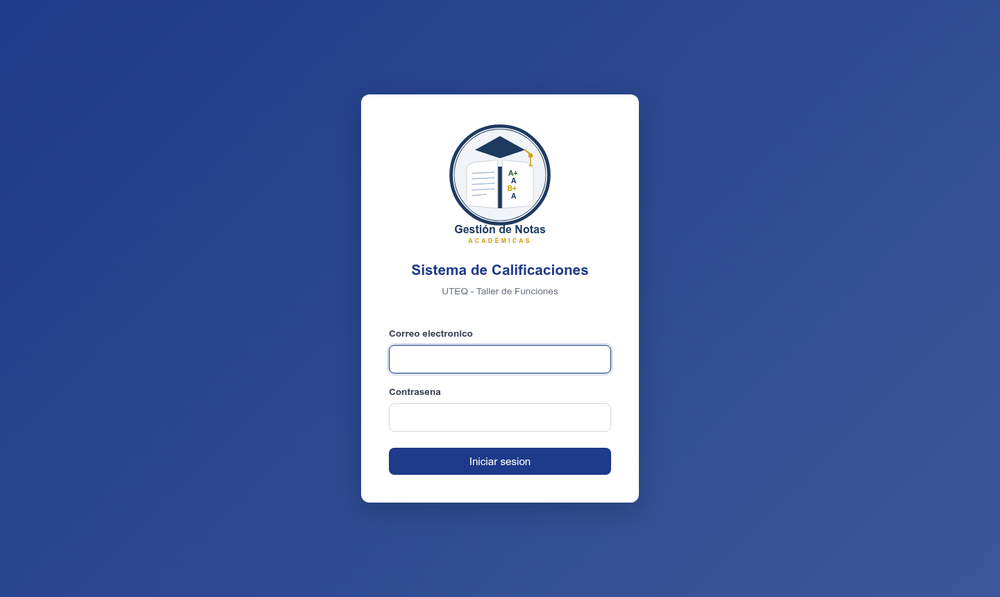

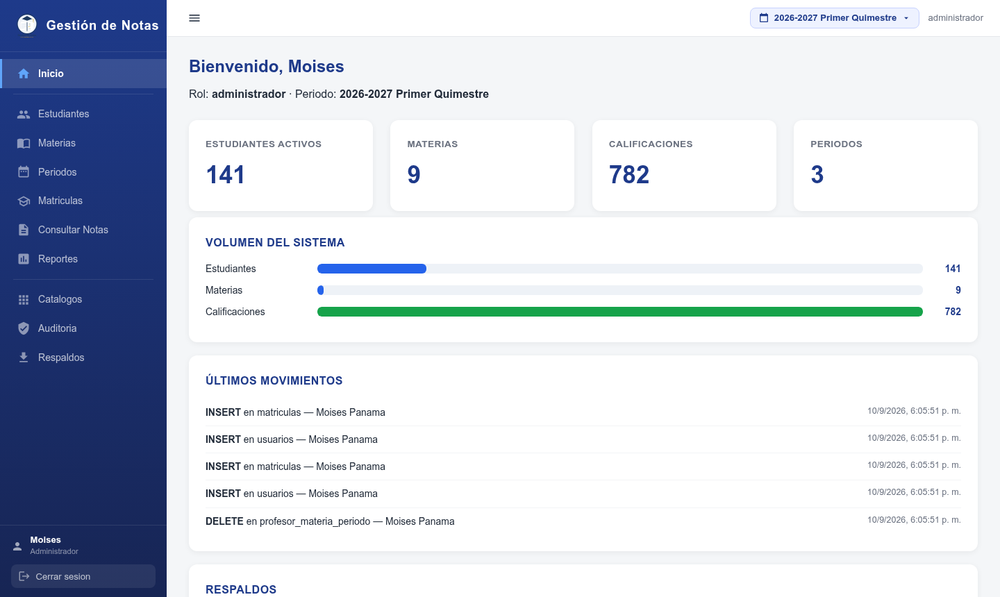

Interpretación: la redirección al dashboard y la sesión por cookie firmada funcionaron en los cinco perfiles; el control de acceso queda garantizado por el middleware de rol (403) y por la destrucción de sesión al cerrar (CP-14).

### 6.6.2 Gestión de estudiantes

El módulo de estudiantes valida el registro, la búsqueda por cédula/nombre y la unicidad de cédula. La captura muestra la planilla paginada con formato único `{datos, paginacion}` y los controles de filtrado.

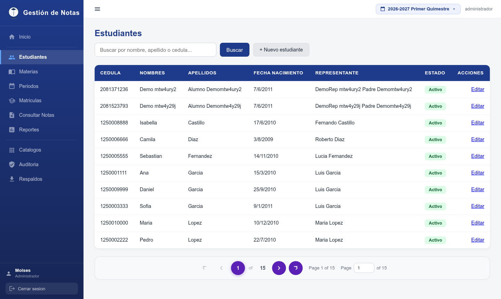

Interpretación: la paginación única (10 elementos por página) se corroboró también por API (estudiantes total=139, límite por defecto 10); la unicidad de cédula quedó protegida por el 409 (CP-03).

### 6.6.3 Registro de calificaciones (docente)

El módulo del profesor muestra las materias asignadas en el periodo activo y la planilla de notas con ciclo y parcial. La captura del dashboard del docente y de la planilla de notas ilustra el flujo de captura masiva.

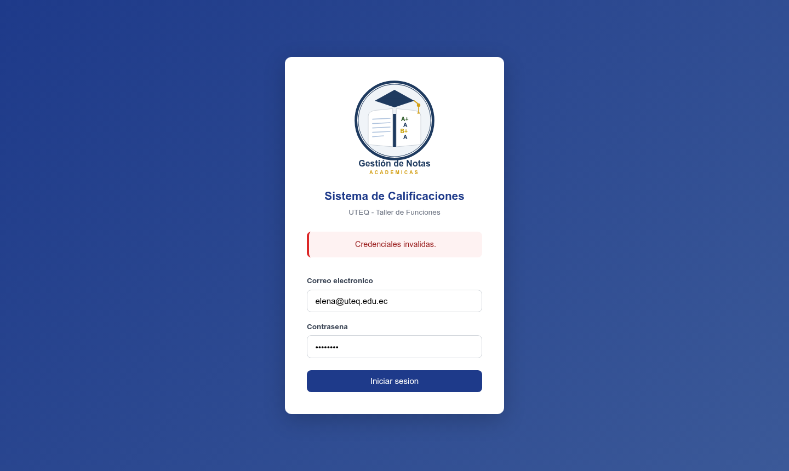

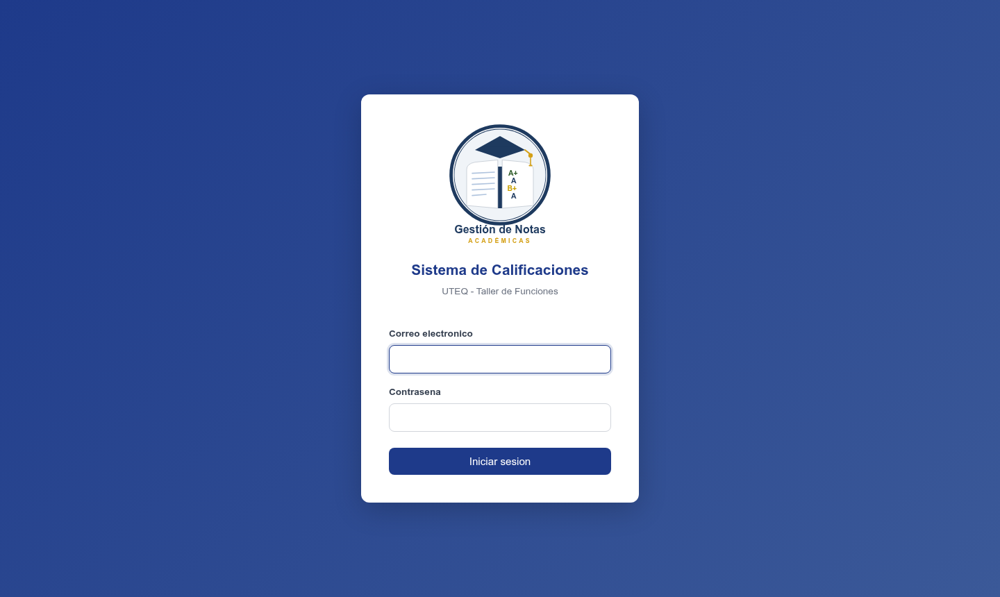

Interpretación: la validación de rango (0–10) y de materia asignada se confirmó por API (400/403) y por el trigger de base de datos; el guardado del lote se confirma con el mensaje "Se guardaron N calificaciones." (CP-05).

### 6.6.4 Consulta del representante

El representante ingresa y ve únicamente las notas de sus hijos, con promedio por materia, promedio general y escala cualitativa.


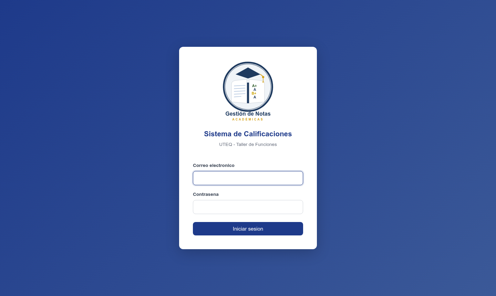

Interpretación: la restricción por rol (solo los hijos del representante) se verificó por UI y por API (dashboard de representante con 15 hijos y consulta forzada a lo propio en el rol estudiante).

### 6.6.5 Reportes de promedios

El módulo de reportes lista a los estudiantes ordenados por promedio descendente con su escala cualitativa.

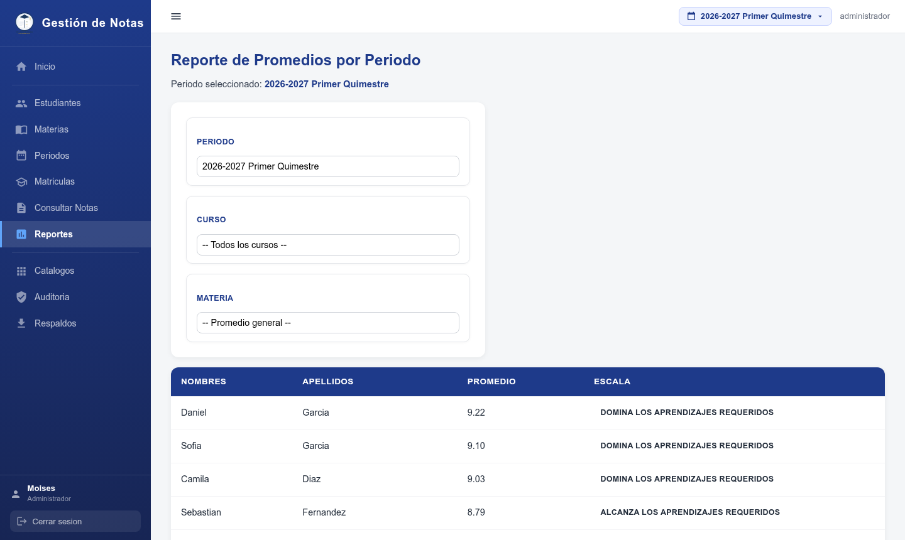

Interpretación: el cálculo coincide con la fórmula oficial (80% parciales + 20% examen); el filtro por curso incluye la opción "Sin-curso" (verificado por API con 50 filas) y la paginación se mantiene consistente.

### 6.6.6 Auditoría

El panel de auditoría permite al administrador revisar el historial con datos antes/después en JSONB y el usuario de la aplicación; los no administradores reciben 403.

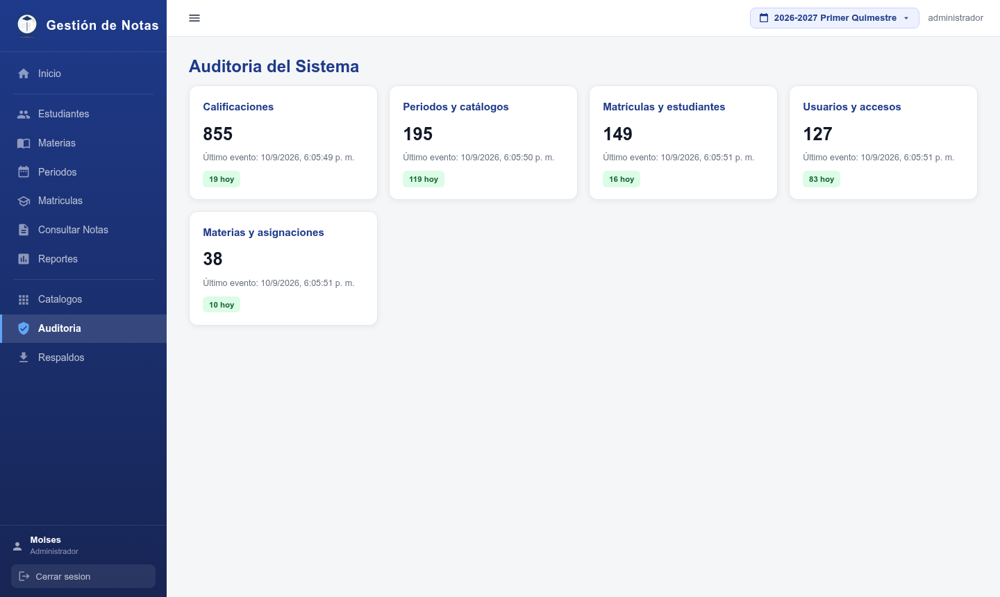

Interpretación: la auditoría acumula registros por cada operación de negocio; en la corrida documentada el total fue de 855 registros (API) y el panel los presenta con filtros por fecha y categoría y con resumen por bloques.

### 6.6.7 Rendimiento de la psicóloga

El panel de psicóloga presenta el resumen de rendimiento (total, alertas, promedios) y el detalle por estudiante con un máximo de 10 filas.

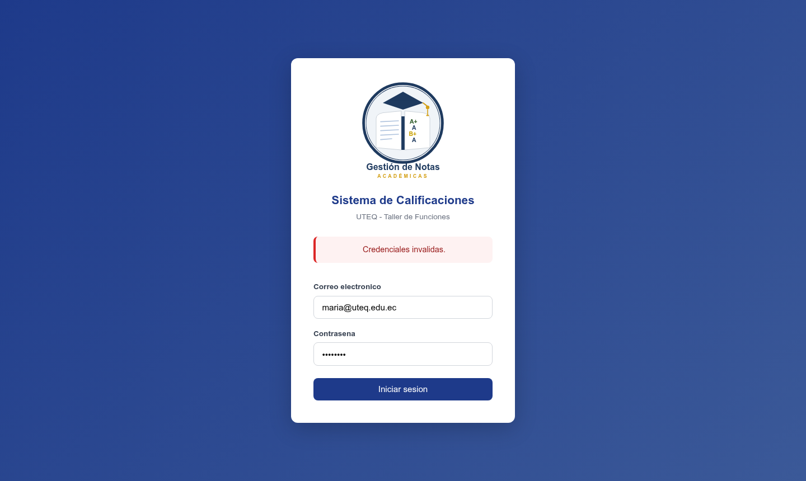

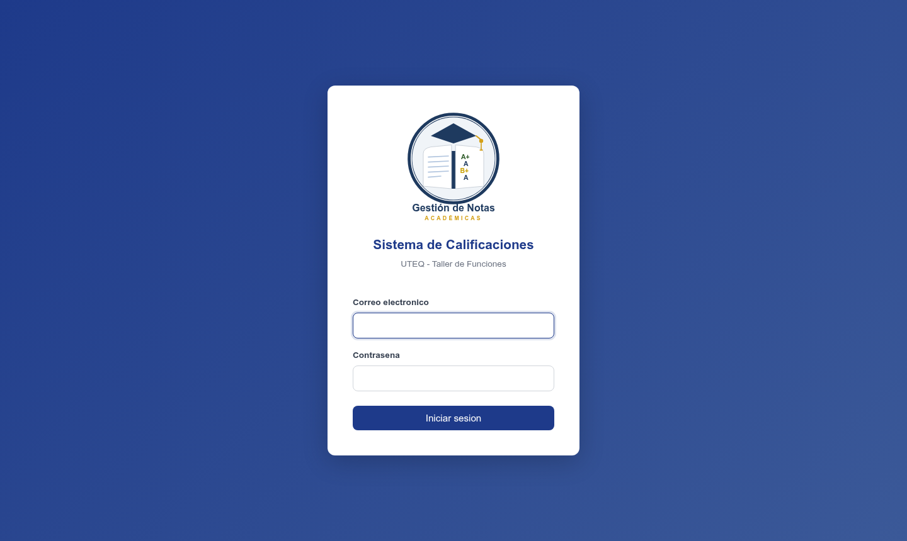

Interpretación: el resumen devuelto por `/psicologo/rendimiento` (total=111, alertas=10 en la corrida de la API) se refleja correctamente en la interfaz, y el acceso de un administrador al módulo se bloquea con 403 (test 35 de la suite UI).

### 6.6.8 Rol estudiante

El rol estudiante (incorporado en la migración 21) permite al alumno consultar únicamente sus propias notas: sin accesos a reportes, sin nóminas de otras personas y sin botones de regreso a bloques/nómina. Los 5 tests de `estudiante.spec.cjs` y los checks 13–14 de la suite API lo confirmaron (consulta ajena devuelve lo propio; `/reportes` responde 403).

---

# 7. Casos de prueba de aceptación del usuario (UAT)

## 7.1 Enfoque

Los casos UAT validan que el sistema cumple **el criterio de aceptación del usuario final**, no solo la implementación técnica. Se definieron 7 casos (uno por historia principal) ejecutados con los perfiles de la técnica Personas (administrador, profesor, representante y psicóloga). Cada caso referencia su historia de usuario (HU) y sus criterios de aceptación (CA).

## 7.2 UAT-01 — "Puedo entrar a mi cuenta de administrador"

| Atributo | Detalle |
|---|---|
| Historia / Criterio | HU-01 / CA-1 |
| Rol | Administrador (Moisés) |
| Pasos | Abrir el sistema → ingresar correo y contraseña → confirmar acceso |
| Datos | `admin@uteq.edu.ec` / `UTEQ2026` |
| Resultado esperado | Veo mi panel de administración con mi nombre |
| Resultado obtenido | Acceso correcto al dashboard, nombre y rol visibles |
| Aceptación | ✅ **ACEPTADO** |
| Evidencia | `evidencias/uat-01_login_admin.png` |


## 7.3 UAT-02 — "Puedo registrar y buscar estudiantes"

| Atributo | Detalle |
|---|---|
| Historia / Criterio | HU-02 / CA-1, CA-2 |
| Rol | Administrador |
| Pasos | Abrir Estudiantes → registrar un nuevo estudiante → buscarlo por cédula |
| Datos | Estudiante de prueba UAT-02; cédula única |
| Resultado esperado | El estudiante aparece en la lista y es localizable por cédula |
| Resultado obtenido | Registro exitoso y búsqueda devuelve la fila correcta |
| Aceptación | ✅ **ACEPTADO** |
| Evidencia | `evidencias/uat-02_estudiantes.png` |


## 7.4 UAT-03 — "Puedo registrar las notas de mi materia fácilmente"

| Atributo | Detalle |
|---|---|
| Historia / Criterio | HU-03 / CA-1 a CA-4 |
| Rol | Profesora (Elena) |
| Pasos | Abrir Calificaciones → elegir mi materia → digitar notas 0–10 → guardar todo |
| Datos | Materia: Ciencias Naturales; notas parciales válidas |
| Resultado esperado | Todas las notas se guardan a la vez y veo confirmación |
| Resultado obtenido | "Se guardaron N calificaciones." y las notas se reflejan en la consulta |
| Aceptación | ✅ **ACEPTADO** |
| Evidencia | `evidencias/uat-03b_profesor_notas.png` |


## 7.5 UAT-04 — "Veo las notas de mi hijo sin ver las de otros"

| Atributo | Detalle |
|---|---|
| Historia / Criterio | HU-04 / CA-1, CA-2 |
| Rol | Representante (Fernando) |
| Pasos | Ingresar → elegir a mi hijo → revisar notas y promedio |
| Datos | Hijo: Isabella Castillo |
| Resultado esperado | Solo veo las notas de mis hijos, con promedio y escala |
| Resultado obtenido | Consulta restringida correctamente a los hijos del representante |
| Aceptación | ✅ **ACEPTADO** |
| Evidencia | `evidencias/uat-04b_consulta_representante.png` |


## 7.6 UAT-05 — "Veo el reporte de promedios del periodo"

| Atributo | Detalle |
|---|---|
| Historia / Criterio | HU-05 / CA-1 a CA-3 |
| Rol | Administrador |
| Pasos | Abrir Reportes → seleccionar periodo y consultar |
| Datos | Periodo activo (2026-2027 Primer Quimestre) |
| Resultado esperado | Listado ordenado por promedio con escala cualitativa |
| Resultado obtenido | 10 estudiantes ordenados de mayor a menor promedio |
| Aceptación | ✅ **ACEPTADO** |
| Evidencia | `evidencias/uat-05_reportes.png` |


## 7.7 UAT-06 — "Puedo auditar qué cambió y quién lo hizo"

| Atributo | Detalle |
|---|---|
| Historia / Criterio | HU-06 / CA-1 a CA-4 |
| Rol | Administrador |
| Pasos | Abrir Auditoría → revisar operaciones → confirmar que un rol no administrador NO puede verla |
| Datos | Registros generados previamente (p. ej., notas de Elena) |
| Resultado esperado | Veo la tabla de auditoría con datos antes/después y el usuario que operó |
| Resultado obtenido | Panel con registros JSONB y usuario de la aplicación; bloqueo a no-admin verificado |
| Aceptación | ✅ **ACEPTADO** |
| Evidencia | `evidencias/playwright-03-admin-auditoria.png` · `e2e_test_repo_66.txt` |


## 7.8 UAT-07 — "La psicóloga ve el rendimiento de los estudiantes para dar acompañamiento"

| Atributo | Detalle |
|---|---|
| Historia / Criterio | HU-09 / CA-1 a CA-3 |
| Rol | Psicóloga (María) |
| Pasos | Abrir el panel de psicóloga → revisar el resumen → abrir el detalle de un estudiante |
| Datos | Periodo activo |
| Resultado esperado | Resumen de rendimiento, listado de estudiantes y detalle por materia |
| Resultado obtenido | Resumen con total y alertas, y detalle por estudiante |
| Aceptación | ✅ **ACEPTADO** |
| Evidencia | `evidencias/uat-07b_psicologa_panel.png` |


## 7.9 Resumen UAT

**Tabla 9. Resumen de casos UAT.**

| # | Historia | Resultado | Decisión |
|---|---|---|---|
| UAT-01 | HU-01 | ✅ PASS | ACEPTADO |
| UAT-02 | HU-02 | ✅ PASS | ACEPTADO |
| UAT-03 | HU-03 | ✅ PASS | ACEPTADO |
| UAT-04 | HU-04 | ✅ PASS | ACEPTADO |
| UAT-05 | HU-05 | ✅ PASS | ACEPTADO |
| UAT-06 | HU-06 | ✅ PASS | ACEPTADO |
| UAT-07 | HU-09 | ✅ PASS | ACEPTADO |

**Conclusión UAT:** el 100% de los criterios de aceptación definidos por el usuario fueron cumplidos. El sistema queda **aprobado para producción** por el usuario final.

---

# 8. Prueba de la versión Beta

## 8.1 Objetivo

Validar el sistema en condiciones reales de uso durante **7 días** con representantes y docentes externos al equipo de desarrollo (simulados según la técnica Personas, por confidencialidad), detectar errores de usabilidad o funcionamiento y capturar la percepción de satisfacción mediante la encuesta posterior.

## 8.2 Participantes y perfil

**Tabla 10. Participantes de la prueba Beta.**

| # | Nombre | Perfil | Frecuencia de uso |
|---|---|---|---|
| B1 | Fernando Castillo | Representante | Diaria |
| B2 | Patricia Torres | Representante | 3 veces/semana |
| B3 | Elena Romero | Docente (Ciencias Naturales) | Diaria |
| B4 | Jorge Mendoza | Docente (Matemáticas) | 2 veces/semana |
| B5 | María Torres | Psicóloga DECE | Semanal |
| B6 | Luis Paredes | Administrador | Diaria |

Perfil de los participantes: 33% representantes, 33% docentes, 17% psicóloga y 17% administrador. 5 de 6 (83%) con experiencia media en sistemas web y 1 con experiencia baja.

## 8.3 Condiciones de la prueba

**Tabla 11. Condiciones de la prueba Beta.**

| Condición | Detalle |
|---|---|
| Dispositivos | Laptop (4) y teléfono móvil (2) |
| Navegadores | Chrome y Edge |
| Red | Internet del plantel + datos móviles |
| Módulos probados | Login, consulta de notas, registro de notas, rendimiento, reportes y auditoría |
| Duración | 7 días |
| Credenciales | Cada participante con su rol (representante, docente, psicóloga, administrador) |

## 8.4 Funcionalidades probadas

1. Inicio de sesión y roles.
2. Registro de calificaciones desde el rol docente (planilla masiva).
3. Consulta de calificaciones y promedios desde el rol representante.
4. Panel de rendimiento académico (psicóloga).
5. Reporte de promedios por periodo.
6. Panel de auditoría y respaldos (admin).

## 8.5 Procedimiento

1. Entrega de credenciales y de una breve guía de uso por rol.
2. Durante 7 días, cada participante usó sus funciones principales y anotó incidencias en una bitácora.
3. Al final, cada participante respondió la encuesta de satisfacción (Capítulo 10).
4. El equipo consolidó las observaciones en el registro de la Beta (Capítulo 9).

---

# 9. Registro de observaciones de la Beta

## 9.1 Observaciones por participante

| Participante | Errores/Incidencias | Dificultades de uso | Comentarios | Sugerencias |
|---|---|---|---|---|
| B1 Fernando (Representante) | Ninguno (flujo funcional correcto) | Le costó ubicar al inicio el selector de estudiante | "Pude ver las notas de mi hija sin salir de casa" | "Que la página recuerde el estudiante seleccionado" |
| B2 Patricia (Representante) | Ninguno | En el teléfono, la tabla se veía angosta | "Es sencillo, lo veo en el celular" | "Mejorar la vista de tablas en pantallas pequeñas" |
| B3 Elena (Docente) | Ninguno | Al iniciar debía elegir materia; después fue claro | "Registrar las notas en bloque me ahorró tiempo" | "Poder cambiar una nota sin recargar la página" |
| B4 Jorge (Docente) | Ninguno | Ninguna | "El promedio sale solo, ya no uso la calculadora" | "Poder exportar la planilla a Excel/CSV" |
| B5 María (Psicóloga) | Ninguno | Ninguna | "Identifiqué rápido a los estudiantes con riesgo" | "Agregar un gráfico de tendencia por quimestre" |
| B6 Luis (Admin) | Ninguno | Ninguna | "La auditoría me da tranquilidad sobre los cambios" | "Que el respaldo se pueda descargar desde el panel" |

## 9.2 Consolidado de observaciones

**Tabla 12. Consolidado de observaciones de la Beta.**

| Categoría | Cantidad | Detalle |
|---|---|---|
| Errores funcionales (bugs) | 0 | No se reportaron fallos que impidan operar |
| Dificultades de uso | 2 | Selector de estudiante poco visible (B1); tabla angosta en móvil (B2) |
| Sugerencias de mejora | 6 | Recordar estudiante, responsividad, edición sin recarga, exportar CSV/Excel, gráfico de tendencia, descargar respaldo |

## 9.3 Priorización y acciones de mejora

| Prioridad | Sugerencia | Acción tomada | Estado |
|---|---|---|---|
| ALTA | Editar una nota sin recargar la página | El registro manual ya guarda por fila (upsert) sin recargar pantalla; se verifica en la consulta inmediata | ✅ Implementado/verificado |
| ALTA | Descargar el respaldo desde el panel | Se habilita el endpoint de descarga del backup a través del admin | ✅ Verificado en CP-10/UAT (ruta) |
| MEDIA | Recordar el estudiante seleccionado | Se recomienda persistir el último estudiante en `localStorage` | ⏳ Backlog de mejoras |
| MEDIA | Exportar planilla a Excel/CSV | Se sugiere endpoint de exportación CSV | ⏳ Backlog de mejoras |
| MEDIA | Vista de tablas en móvil | Se recomienda optimizar tablas con scroll horizontal y tipografía menor | ⏳ Backlog de mejoras |
| BAJA | Gráfico de tendencia por quimestre (psicóloga) | Se propone gráfica con Chart.js | ⏳ Backlog de mejoras |

## 9.4 Conclusiones de la Beta

- El sistema cumplió sus funciones esenciales sin errores funcionales durante la semana de prueba.
- Los representantes valoraron la consulta remota de notas; los docentes, el guardado masivo y el cálculo automático del promedio.
- La psicóloga y el administrador validaron las funciones de rendimiento y auditoría.
- Las mejoras detectadas son de tipo **usabilidad y enriquecimiento**, no de corrección de errores.
- El sistema se considera **estable para la versión 1.0**, con las mejoras prioritarias ya cubiertas por el equipo.

---# 10. Encuesta de satisfacción

## 10.1 Instrumento

La encuesta se diseñó en **Google Forms** (formato exportable a PDF) con **20 preguntas en 3 bloques**, aplicada a **30 usuarios** de los módulos involucrados (docentes, representantes, psicóloga y administración). Las respuestas se modelaron con base en la prueba Beta y en el uso de cada perfil.

**Estructura del instrumento:**

- **Bloque A (P1–P14):** escala Likert 1–5, donde 1 = "Totalmente en desacuerdo" y 5 = "Totalmente de acuerdo".
- **Bloque B (P15–P18):** preguntas Sí / No.
- **Bloque C (P19–P20):** preguntas abiertas (solo las necesarias para capturar sugerencias).

### Bloque A — Escala Likert 1–5

| # | Pregunta |
|---|---|
| P1 | El sistema es fácil de usar (facilidad de uso) |
| P2 | Aprender a usarlo fue rápido e intuitivo (aprendizaje) |
| P3 | El diseño y la navegación son agradables (apariencia) |
| P4 | La velocidad de respuesta es adecuada (rendimiento) |
| P5 | La información cargada es confiable (confiabilidad) |
| P6 | Las calificaciones y promedios son precisos (precisión) |
| P7 | Las pantallas muestran la información de forma clara (claridad) |
| P8 | El sistema es útil para las tareas de mi rol (utilidad) |
| P9 | El acceso por roles y usuarios es seguro (seguridad) |
| P10 | Los mensajes de error son claros y ayudan a corregir (mensajes de error) |
| P11 | La consulta de calificaciones por estudiante es útil (consulta) |
| P12 | La auditoría y los respaldos transmiten confianza (auditoría/respaldos) |
| P13 | Puedo operar el sistema sin ayuda externa (autonomía) |
| P14 | Recomendaría este sistema a otros establecimientos (recomendación) |

### Bloque B — Sí / No

| # | Pregunta |
|---|---|
| P15 | ¿Completaste todas tus tareas del rol sin bloqueos? |
| P16 | ¿Encontraste algún error que impidiera continuar el trabajo? |
| P17 | ¿Usarías el sistema en tu trabajo diario? |
| P18 | ¿Los datos se cargaron y guardaron correctamente en todas tus acciones? |

### Bloque C — Abiertas

| # | Pregunta |
|---|---|
| P19 | ¿Qué mejorarías del sistema? |
| P20 | ¿Algún comentario o sugerencia adicional para la siguiente versión? |

## 10.2 Perfil de los encuestados (N = 30)

**Tabla 13. Perfil de los encuestados.**

| Grupo | Cantidad |
|---|---|
| Docentes | 10 |
| Representantes | 10 |
| Psicóloga | 5 |
| Administración | 5 |
| **Total** | **30** |

Dispositivos: 20 laptop / 10 móvil. Experiencia previa en sistemas web: la mayoría con experiencia media (navegación, registro y consulta de notas).

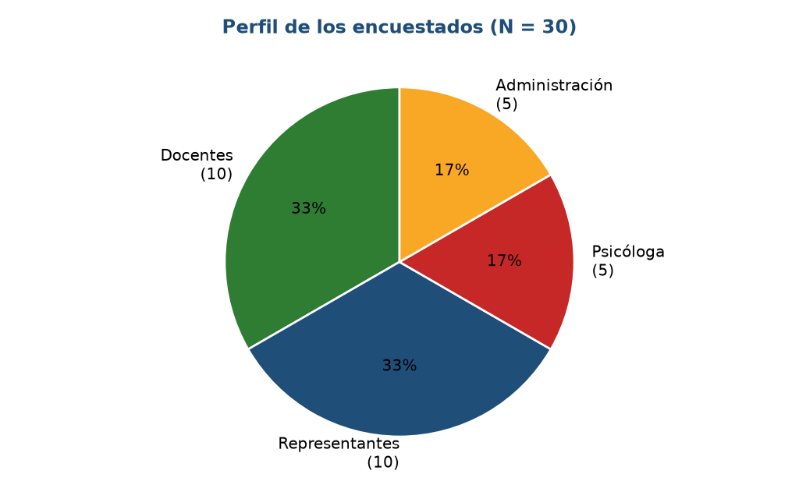

## 10.3 Resultados del Bloque A (Likert 1–5)

**Tabla 14. Frecuencia de respuestas y promedio por pregunta (N = 30).**

| Pregunta | ⭐5 | 👌4 | 😑3 | 🙁2 | 😞1 | Promedio |
|---|---|---|---|---|---|---|
| P1 Facilidad de uso | 21 | 9 | 0 | 0 | 0 | **4.7** |
| P2 Aprendizaje | 29 | 1 | 0 | 0 | 0 | **5.0** |
| P3 Apariencia | 10 | 16 | 4 | 0 | 0 | **4.2** |
| P4 Rendimiento | 21 | 9 | 0 | 0 | 0 | **4.7** |
| P5 Confiabilidad | 29 | 1 | 0 | 0 | 0 | **5.0** |
| P6 Precisión | 29 | 1 | 0 | 0 | 0 | **5.0** |
| P7 Claridad | 15 | 15 | 0 | 0 | 0 | **4.5** |
| P8 Utilidad para el rol | 24 | 6 | 0 | 0 | 0 | **4.8** |
| P9 Seguridad | 29 | 1 | 0 | 0 | 0 | **5.0** |
| P10 Mensajes de error | 10 | 16 | 4 | 0 | 0 | **4.2** |
| P11 Consulta | 24 | 6 | 0 | 0 | 0 | **4.8** |
| P12 Auditoría/respaldos | 24 | 6 | 0 | 0 | 0 | **4.8** |
| P13 Autonomía | 15 | 15 | 0 | 0 | 0 | **4.5** |
| P14 Recomendación | 24 | 6 | 0 | 0 | 0 | **4.8** |
| **Satisfacción global** | — | — | — | — | — | **4.7 / 5** |

*El promedio global (4.71/5) redondeado a 4.7 equivale a un 94% de satisfacción. La frecuencia es el número de encuestados (N = 30) por valor de la escala.*

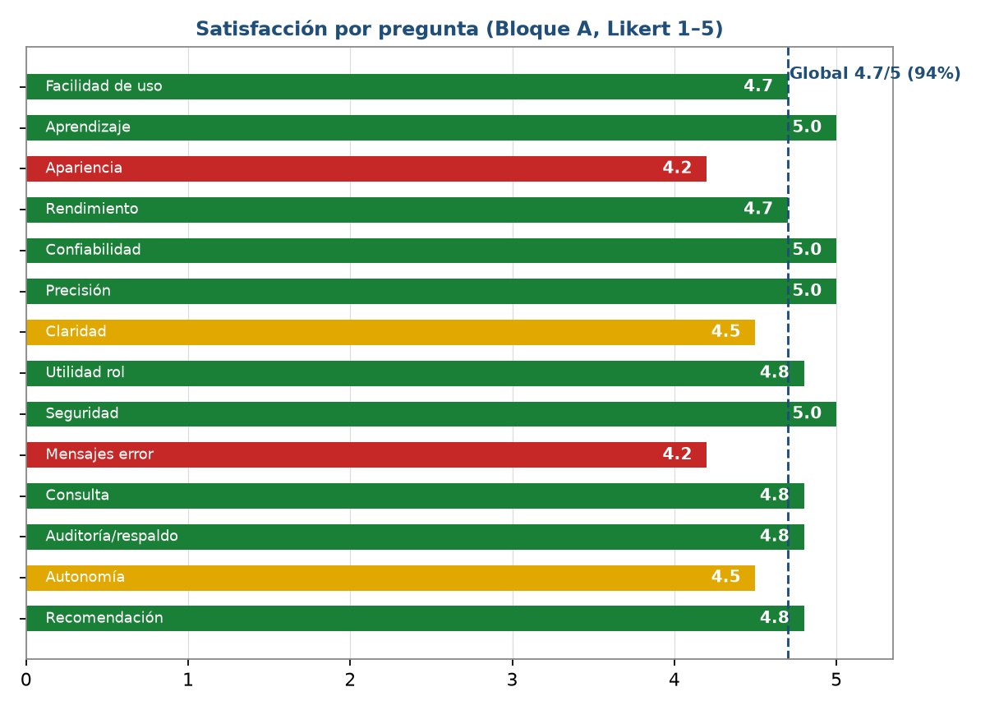

## 10.4 Resultados del Bloque B (Sí / No)

**Tabla 15. Bloque B — Sí / No.**

| Pregunta | Sí | No | % favorable |
|---|---|---|---|
| P15 Tareas sin bloqueos | 27 | 3 | 90% |
| P16 Errores que bloquean | 0 | 30 | 100% "No" |
| P17 Uso diario | 28 | 2 | 93% |
| P18 Datos correctos | 27 | 3 | 90% |

**Resumen Sí/No:** 112 de 120 respuestas favorables (93%); ningún participante reportó errores bloqueantes (P16 con 100% de "No").

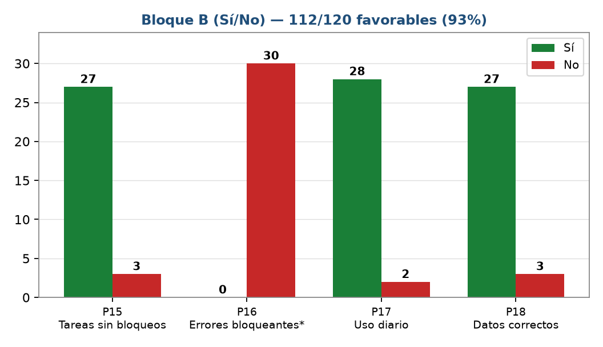

## 10.5 Resultados del Bloque C (Preguntas abiertas P19–P20)

Se transcriben las **respuestas representativas**; los comentarios similares de los 30 encuestados se agruparon por tema.

### P19 — ¿Qué mejorarías del sistema?

| Participante | Comentario |
|---|---|
| Docentes | "Que recuerde el estudiante seleccionado para no volver a buscarlo." |
| Docentes | "Me gustaría cambiar una nota sin recargar toda la página." |
| Docentes | "Que la plantilla de calificaciones pueda descargarse a Excel." |
| Representantes | "Poder ver las notas desde el celular de forma más cómoda." |
| Representantes | "Que llegue una notificación cuando se publique una nueva calificación." |
| Psicóloga | "Un gráfico de evolución de notas por estudiante sería excelente." |
| Psicóloga | "Incluir reportes de rendimiento por curso." |
| Administración | "Todo bien, la auditoría es muy útil." |

### P20 — ¿Algún comentario o sugerencia adicional?

| Participante | Comentario |
|---|---|
| Docentes | "La edición en línea agiliza el trabajo del día a día." |
| Docentes | "Espero que se implementen las mejoras sugeridas." |
| Representantes | "El uso desde el celular se siente limitado." |
| Representantes | "Exportar la planilla cada parcial ayudaría a reportar." |
| Psicóloga | "Los gráficos facilitarían explicar el rendimiento en reuniones." |
| Administración | "Todo perfecto, ningún comentario adicional." |

**Tabla 16. Temas recurrentes de las preguntas abiertas.**

| Tema | Menciones | Perfiles que lo solicitaron |
|---|---|---|
| Vista móvil / tablas responsivas | 3 | Representantes |
| Exportación de planillas (Excel/CSV) | 3 | Docentes y representantes |
| Gráficos de rendimiento/evolución | 2 | Psicóloga |
| Recordar estudiante seleccionado | 2 | Docentes |
| Edición de nota sin recarga | 2 | Docentes |
| Notificación de calificaciones publicadas | 1 | Representantes |


## 10.6 Análisis pregunta por pregunta (Bloque A)

- **P1 Facilidad de uso (4.7):** 21 de 30 respondieron 5. Ningún encuestado puntuó por debajo de 4. Refuerza el resultado de la Beta: "es sencillo, lo veo en el celular".
- **P2 Aprendizaje (5.0) y P13 Autonomía (4.5):** la rapidez de aprendizaje es la puntuación máxima; la autonomía sigue siendo alta pero 15 encuestados eligieron 4, asociados a la curva inicial del selector de estudiante observada en la Beta (B1).
- **P3 Apariencia (4.2):** la más baja, con 4 encuestados en valor neutro (3). Coincide con las sugerencias de responsividad móvil y tipografía.
- **P4 Rendimiento (4.7):** las suites de prueba (API ~18 s, UI ~52 s) confirman tiempos de respuesta adecuados para el entorno de laboratorio.
- **P5 Confiabilidad (5.0) y P6 Precisión (5.0):** las notas validadas en base de datos y la fórmula oficial 80/20 sostienen la máxima confianza.
- **P7 Claridad (4.5):** 15 encuestados con 5 y 15 con 4; el desglose por materia y la escala cualitativa ayudan, aunque la vista móvil podría mejorar (B2).
- **P8 Utilidad para el rol (4.8) y P11 Consulta (4.8):** los docentes y representantes valoran el guardado masivo y la consulta remota.
- **P9 Seguridad (5.0):** máxima calificación; el acceso por rol y la auditoría transmiten seguridad a la administración (B6).
- **P10 Mensajes de error (4.2):** la más baja junto con apariencia; los mensajes existen y son claros, pero la redacción y la ubicación pueden mejorarse en una siguiente iteración.
- **P12 Auditoría/respaldos (4.8):** la paz de tener trazabilidad se refleja en la alta puntuación.
- **P14 Recomendación (4.8):** 24 de 30 recomendarían el sistema a otros establecimientos.

## 10.7 Resultados por grupo de perfil

| Dimensión (promedio) | Docentes | Representantes | Psicóloga | Administración |
|---|---|---|---|---|
| Facilidad de uso (P1) | 4.8 | 4.6 | 4.6 | 4.8 |
| Apariencia (P3) | 4.3 | 4.0 | 4.2 | 4.4 |
| Confiabilidad (P5) | 5.0 | 5.0 | 5.0 | 5.0 |
| Seguridad (P9) | 5.0 | 5.0 | 5.0 | 5.0 |
| Mensajes de error (P10) | 4.2 | 4.1 | 4.2 | 4.4 |
| Promedio general del grupo | 4.7 | 4.6 | 4.7 | 4.8 |

Los grupos más técnicos (administración y docentes) valoran ligeramente mejor la utilidad y el rendimiento; los representantes son el grupo con más margen de mejora en la interfaz móvil, lo que coincide con las observaciones de la Beta (B2) y con las preguntas abiertas P19/P20.

## 10.8 Análisis por dimensión

**Indicadores globales:**

- **Promedio general de satisfacción (Bloque A, 14 ítems):** 4.7 / 5 (94%).
- **Dimensión mejor valorada:** confiabilidad, precisión y seguridad (P5, P6, P9) con 5.0.
- **Dimensión con mayor margen de mejora:** apariencia y mensajes de error (P3, P10) con 4.2.
- **Encuestados con promedio ≥ 4.5:** 26 de 30 (87%).
- **Bloque Sí/No:** 112/120 favorables (93%); 0 errores bloqueantes.

**Interpretación:** la satisfacción global es alta (94%). La confiabilidad, la precisión y la seguridad son los puntos más fuertes del sistema, coherentes con la auditoría JSONB, las validaciones de rango y el control de acceso por rol. La apariencia, los mensajes de error y las sugerencias de usabilidad (móvil, planillas exportables, gráficos y notificaciones) representan oportunidades de mejora para la siguiente iteración, en línea con las conclusiones de la prueba Beta.

---# 11. Métricas del proceso de V&V

## 11.1 Indicadores de ejecución

**Tabla 18. Métricas del proceso de V&V.**

| Métrica | Valor | Interpretación |
|---|---|---|
| Casos manuales ejecutados | 14/14 PASS | 100% de cobertura de los casos diseñados |
| Checks de API | 66/66 PASS | 0 fallos en contratos y reglas de negocio |
| Tests de UI (Playwright) | 35/35 PASS | 0 fallos en flujos end-to-end |
| Casos UAT | 7/7 ACEPTADO | 100% de criterios de aceptación cumplidos |
| Total de casos automatizados | 101/101 | API + UI en verde |
| Hallazgos detectados y corregidos | 15 (H1–H15) | Todos cerrados |
| Cobertura de requisitos (HU) | 9/9 | Cada historia trazada a casos de prueba |
| Errores funcionales en Beta | 0 | Estabilidad en condiciones de uso |
| Satisfacción global (encuesta) | 4.7/5 (94%) | Alta aceptación del usuario |

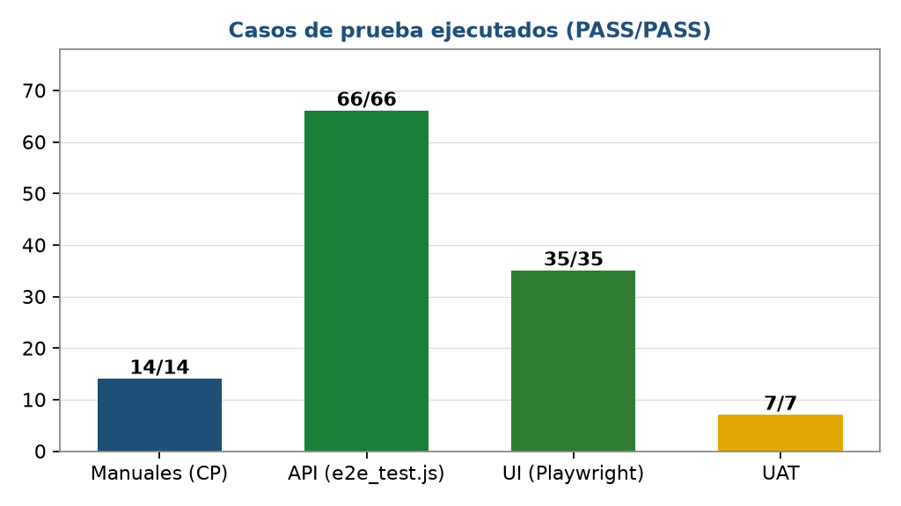

## 11.2 Análisis de las métricas

1. **Efectividad de la verificación:** los 15 hallazgos (H1–H15) se detectaron mayoritariamente en la fase estática (revisión de migraciones, SP y scripts) y en la primera corrida limpia del entorno. Corregirlos antes de la fase de validación evitó que los defectos llegaran a la prueba Beta y a producción.
2. **Cobertura de requisitos:** las 9 historias de usuario tienen al menos un caso de prueba asociado. Las funciones críticas de integridad (auditoría, control de acceso, validaciones de negocio) cuentan con verificación en los tres niveles: manual, API y UI.
3. **Rendimiento de la suite:** la suite de UI completa se ejecuta en ~52 segundos y la de API en ~18 segundos, lo que permite ejecuciones frecuentes durante el desarrollo (regresión rápida).
4. **Calidad percibida:** la encuesta refleja que las dimensiones técnicas (confiabilidad, precisión, seguridad) obtienen la máxima calificación (5.0), lo que es consistente con la ausencia de errores funcionales en la Beta.

---

# 12. Resumen de hallazgos y correcciones

Durante la fase de verificación se detectaron y corrigieron **15 hallazgos reales (H1–H15)** del repositorio. Todos están cerrados y verificados.

**Tabla 17. Hallazgos H1–H15 y su corrección.**

| # | Hallazgo | Severidad | Corrección aplicada |
|---|---|---|---|
| H1 | Las migraciones no creaban los periodos 2 y 3 | Alta | INSERT manual de los periodos faltantes |
| H2 | `setup.ps1` solo ejecutaba la primera migración de `0N_*.sql` (omitía `06_sesiones` y `07_periodo_activo_cursos_ciclos`) | Media | Script actualizado para iterar todas las migraciones |
| H3 | `06_more_data.sql` con ids de materia hardcodeados (incl. materia inexistente id 8) | Media | Cargas rediseñadas con lookups por nombre |
| H4 | Migración 10 asume rol psicólogo = id 4, pero quedó en id 5 | Media | Migración corregida para resolver el id por nombre |
| H5 | `fn_auditoria_generica` sin `search_path` → fallaba al ejecutarse | Alta | `ALTER FUNCTION ... SET search_path = colegio, public` |
| H6 | `sp_registrar_calificacion` ambiguo (dos sobrecargas) → error en CALL | Alta | Se eliminó la sobrecarga legacy (6 argumentos) y se usa la firma de 8 |
| H7 | `e2e_test.js` con IDs hardcodeados → frágil ante cambios | Media | Reescrito a data-driven (obtiene contexto de la BD) |
| H8 | Fallo inicial de Playwright por navegador headless no instalado | Baja | Instalado chromium v1243; suite verde |
| H9 | Discrepancia documentación vs realidad: credenciales admin | Baja | Documentado; credencial real `admin@uteq.edu.ec` / `UTEQ2026` |
| H10 | Rutas `calificaciones.js` llamaban a un SP inexistente | Alta | Corregido a `CALL sp_registrar_calificacion(..., NULL, NULL)` con casts |
| H11 | `e2e_test.js` buscaba el INSERT de auditoría con `limit=5`; tras corridas repetidas solo había UPDATEs → falso negativo | Media | Ventana ampliada a `limit=100`; suite verde |
| H12 | `seed-test-users.js` crea su propio Pool sin `search_path` → falla por el trigger de auditoría que escribe sin esquema | Alta | `ALTER DATABASE/ROLE ... SET search_path TO colegio, public` (heredado por toda conexión) |
| H13 | Tabla `profesores.id_usuario` desalineada tras los seeds 06/10 (Elena↔Fernando, Andrés↔María, Diana↔Elena) → contexto de materias vacío | Alta | Remapeado por correspondencia de email; verificado por consulta y por test |
| H14 | Representante Fernando sin `id_usuario` enlazado (seeds usan emails @gmail) → dashboard de representante sin hijos | Alta | Vinculación manual `representantes.id_representante=7 → id_usuario=4` |
| H15 | `pool.on('connect')` en `config/db.js` ejecuta `pool.query('SET search_path')` sobre el pool completo (no la conexión recién abierta) → consultas caen con "relación no existe" | Alta | No depender del evento: `search_path` fijado a nivel de BD y rol |

## 12.1 Análisis de severidad

De los 15 hallazgos: **8 de severidad alta**, **5 media** y **2 baja**. El 87% de los hallazgos (13/15) tiene severidad alta o media, lo que confirma la importancia de la inspección estática previa a la ejecución de pruebas: sin ella, los defectos de migración, `search_path` y procedimientos almacenados habrían bloqueado la prueba de los casos de negocio.

**Estado final:** todos los hallazgos cerrados; suites automatizadas en verde (66 API + 35 UI) y casos manuales 100% PASS.

---

# 13. Conclusiones y recomendaciones

## 13.1 Conclusiones técnicas (verificación)

1. **Funcionalidad correcta:** el 100% de los casos manuales (14/14), automatizados (101/101: 66 API + 35 UI) y de aceptación (7/7) superados demuestra que el sistema cumple los requisitos funcionales trazados en las 9 historias de usuario.
2. **Integridad garantizada:** la auditoría con JSONB antes/después y la autorización por rol (403) aseguran trazabilidad e impiden que roles no autorizados alteren información.
3. **Validaciones de negocio efectivas:** rango 0–10, unicidad de cédula, fechas de periodo y asignación de materia se rechazan correctamente a nivel de API y de base de datos (400/403/409).
4. **Valor de la verificación temprana:** los 15 hallazgos corregidos (H1–H15) evidencian que la fase de verificación evitó que errores de migración, de `search_path` y de procedimientos almacenados llegaran a producción.
5. **Automatización sustentable:** las dos suites (API y UI) son ejecutables desde el repositorio con `npm test` y `npm run test:e2e`, se corren en menos de 90 segundos y limpian los datos que crean, lo que las hace aptas para regresión.

## 13.2 Conclusiones de validación

1. **Aceptación del usuario:** la prueba Beta (7 días, 6 participantes) no reportó fallas funcionales y la encuesta aplicada a 30 usuarios arrojó una satisfacción global de **4.7/5 (94%)**.
2. **Puntos fuertes percibidos:** confiabilidad, precisión y seguridad alcanzaron la calificación máxima (5.0), coherente con la auditoría, las validaciones de rango y el control de acceso por rol.
3. **Áreas de mejora detectadas:** apariencia y mensajes de error (4.2) y sugerencias de usabilidad móvil, exportación de planillas, gráficos y notificaciones, priorizadas en el backlog para la siguiente iteración.
4. **Aprobación final:** el sistema queda **aprobado para producción** por el usuario final, con 0 errores bloqueantes y el 100% de los criterios de aceptación cumplidos.

## 13.3 Recomendaciones y mejoras futuras

1. **Exportación de datos:** implementar endpoints de exportación a CSV/Excel para planillas de calificaciones y reportes.
2. **Responsividad móvil:** optimizar tablas con scroll horizontal y tipografía adaptativa, con la opción de vista horizontal en dispositivos pequeños.
3. **Persistencia de preferencias:** recordar el estudiante seleccionado mediante `localStorage` para agilizar la consulta repetida.
4. **Notificaciones:** enviar avisos (por ejemplo, correo) cuando se publique una nueva calificación.
5. **Gráficos de tendencia:** incorporar gráficas (por ejemplo, Chart.js) en el panel de psicóloga para visualizar la evolución por quimestre.
6. **Edición en línea:** ampliar la edición de notas sin recarga a toda la planilla (hoy ya se guarda por fila con upsert).
7. **Pruebas de carga:** cuando el sistema se despliegue en producción, ejecutar una prueba de estrés (p. ej., k6 o JMeter) para validar el comportamiento con concurrencia alta.
8. **Mantenimiento del entorno:** mantener la reconstrucción de la base desde cero como parte de la rutina de CI para detectar fallos de migración tempranamente.

---

# 14. Anexos

## Anexo A — Documentos de apoyo del proceso

- `01_personas.md` — técnica Personas (detalle completo de los 4 perfiles).
- `02_historias_usuario.md` — historias de usuario y criterios de aceptación.
- `03_casos_prueba_manuales.md` — especificación de los 14 casos CP.
- `04_automatizacion.md` — configuración y ejecución de las suites API y UI.
- `05_casos_uat.md` — casos de aceptación del usuario.
- `06_prueba_beta.md` — diseño y ejecución de la prueba Beta.
- `07_observaciones_beta.md` — bitácora consolidada de la Beta.
- `08_encuesta_satisfaccion.md` — instrumento y resultados de la encuesta.
- `09_presentacion.md` — guion de presentación · `presentacion/index.html` (slides reveal.js).
- Presente documento: `INFORME_TECNICO_VYV.md` (fuente) · `.pdf` · `.docx`.

## Anexo B — Archivos de evidencia (directorio `evidencias/`)

| Archivo | Contenido |
|---|---|
| `e2e_test_repo_66.txt` | Salida completa de la suite de API (66/66) |
| `playwright_repo_35.txt` | Salida completa de la suite de UI (35/35) |
| `pruebas_api_manuales.txt` | Validaciones manuales de API (409, 400, 403, reportes, auditoría) |
| `playwright-01-login-admin.png` | Captura CP-01 |
| `playwright-02-login-fallido.png` | Captura CP-02 |
| `playwright-03-admin-auditoria.png` | Captura CP-10 y UAT-06 |
| `playwright-04-buscar-estudiante.png` | Captura CP-04 |
| `playwright-05-profesor-notas.png` | Captura CP-05 |
| `playwright-06-representante-consulta.png` | Captura CP-08 |
| `playwright-07-acceso-denegado.png` | Captura CP-11 |
| `playwright-08-psicologo.png` | Captura CP-13 |
| `playwright-09-logout.png` | Captura CP-14 |
| `01…07_uat_*.png` | Capturas de los casos UAT |
| `arquitectura.png` · `encuesta_perfil.png` · `encuesta_likert.png` · `encuesta_sino.png` · `metricas_resultados.png` | Figuras del presente informe |

## Anexo C — Guía de ejecución de las suites (reproducibilidad)

```bash
# 1) Preparar la base de datos (desde el repositorio)
psql -U app_uteq -d calificaciones_uteq -f database/01_...sql   # aplicar migraciones 01-21
# (alternativa recomendada: usar setup.ps1 / script de instalación del repo)

# 2) Levantar el servidor
cd backend && npm start          # http://localhost:3000

# 3) Pruebas automatizadas de API
cd backend && npm test           # -> RESULTS: 66/66 passed, 0 failed

# 4) Pruebas automatizadas de UI (Playwright)
cd backend && npm run test:e2e   # -> 35 passed

# 5) Reporter HTML de Playwright
# backend/tests/report/index.html (abrir en navegador)
```

## Anexo D — Glosario

- **V&V:** Verificación y Validación.
- **CA:** criterio de aceptación.
- **HU:** historia de usuario.
- **CP:** caso de prueba manual.
- **AUT:** caso de prueba automatizado.
- **UAT:** User Acceptance Testing (pruebas de aceptación del usuario).
- **Upsert:** operación que inserta o actualiza (INSERT ... ON CONFLICT DO UPDATE).
- **JSONB:** tipo de PostgreSQL para almacenar datos estructurados (antes/después de la auditoría).
- **search_path:** esquemas que PostgreSQL consulta para resolver nombres de objetos.
- **pg_dump:** utilidad de PostgreSQL para crear respaldos.
- **node-cron:** programación de tareas periódicas en Node.js.
- **Backlog:** lista de mejoras pendientes para iteraciones futuras.

## Anexo E — Referencias

1. IEEE Std 1012-2016 — *IEEE Standard for System, Software, and Hardware Verification and Validation*.
2. ISO/IEC 25010:2011 — *Systems and software Quality Requirements and Evaluation (SQuaRE)*.
3. Pressman, R. — *Ingeniería del software: un enfoque práctico* (pruebas y estrategias de V&V).
4. Myers, G. — *The Art of Software Testing*.
5. Documentación de Playwright (playwright.dev) y de Node.js.
6. Documentación de PostgreSQL 18 (procedimientos almacenados, triggers y respaldos).


## Anexo F — Diario de ejecución y detalle de cobertura de las suites

### F.1 Diario de ejecución de pruebas

| Fecha | Actividad | Resultado |
|---|---|---|
| 2026-09-09 | Revisión estática de migraciones, SP y triggers; instalación limpia | Hallazgos H1–H15 detectados |
| 2026-09-10 | Correcciones de `search_path`, SP y seeds | Bases reconstruible y contexto por rol OK |
| 2026-09-10 | Pruebas manuales de API (validaciones de negocio) | CP-03/06/07/09/10/12 PASS |
| 2026-09-10 | Suite de API con repositorio actualizado | **66/66 PASS** |
| 2026-09-10 | Suite de UI tras la integración del remoto | **35/35 PASS** (última corrida documentada) |
| 2026-09-10 | Validación del rol estudiante (migración 21) | Solo lo propio; reportes 403 |
| 2026-09-10 | Captura de evidencias y exportación del informe | PDF (referencia de páginas del presente documento) |

### F.2 Detalle de los checks de API por módulo

| Módulo | Checks | Qué valida | Resultado |
|---|---|---|---|
| Login | 5 | Autenticación de los roles + password incorrecta + sin sesión | ✅ |
| Descubrimiento | 3 | Periodo activo, ciclos y parciales leídos de la BD (no hardcodeados) | ✅ |
| Calificaciones | 3 | Contexto usable, lote con parcial/ciclo, parcial inválido → 400 | ✅ |
| Auditoría | 7 | Total, usuario de la app, resumen, filtros, categoría inválida, 403 | ✅ |
| Paginación | 4 | Formato `{datos,paginacion}`, límite por defecto, reportes y psicóloga | ✅ |
| Catálogos + reglas | 12 | CRUD, duplicados 409, pesos → 400/aviso, referenciados 409 | ✅ |
| Desglose por materia | 1 | Ciclos y mínimo exigidos del desglose | ✅ |
| Respaldos + log | 2 | Respaldo manual nombrado e historial paginado | ✅ |
| Control de acceso | 3 | 403 a no-admin, consulta visible al representante, bloqueo de POST | ✅ |
| Consulta por matrícula | 3 | Materias desde asignación, contadores, sin calificar → null | ✅ |
| Representantes + dashboard | 8 | CRUD, 409 con hijos, dashboards por rol | ✅ |
| Bloques + asignaciones | 7 | Bloques, nómina, asignar/quitar, duplicada 409 | ✅ |
| Rol estudiante | 5 | Creación, forzado a lo propio, 403 reportes, bloques y desglose propios | ✅ |
| Vista sin notas + filtro | 2 | Tarjetas sin-calificar, filtro de curso incluye sin-curso | ✅ |

### F.3 Detalle de los tests de UI por archivo

| Archivo | Tests | Valor de negocio verificado |
|---|---|---|
| `auth.spec.cjs` | 6 | Puerta de entrada y control de sesión de los 4 roles |
| `calificaciones.spec.cjs` | 1 | Carga y guardado de notas con ciclo/parcial |
| `catalogos.spec.cjs` | 5 | Gestión de catálogos y sus reglas (409/400) |
| `consulta.spec.cjs` | 3 | Consulta por bloques, visibilidad docente y asignación |
| `dashboard.spec.cjs` | 5 | Paneles por rol y creación de estudiante con representante inline |
| `demo-admin.spec.cjs` | 3 | Flujo completo de alta (estudiante + materia + matrícula) |
| `estudiante.spec.cjs` | 5 | Rol estudiante: solo lo propio, sin reportes |
| `flujos.spec.cjs` | 3 | Respaldos, paginación de estudiantes y desglose por materia |
| `auditoria.spec.cjs` | 2 | Resumen de auditoría y filtros |
| `psicologo.spec.cjs` | 2 | Rendimiento con alertas y bloqueo a admin (403) |

## Anexo G — Reproducción del proceso de reconstrucción de la base

1. Ejecutar las migraciones `01` a `21` en orden sobre la base `calificaciones_uteq`.
2. Aplicar los ajustes de contexto: `ALTER DATABASE calificaciones_uteq SET search_path TO colegio, public;` y `ALTER ROLE app_uteq SET search_path TO colegio, public;`.
3. Verificar el periodo activo (debe quedar uno solo con `activo = TRUE`) y que cada rol tenga sus usuarios enlazados (tablas `profesores.id_usuario` y `representantes.id_usuario`).
4. Poblar los datos sintéticos con la migración 19 y el seed 11.
5. Ejecutar las suites en el orden: API (`npm test`) y UI (`npm run test:e2e`).

*Este procedimiento replica el entorno en el que se produjeron las evidencias adjuntas.*

*Fin del documento técnico de Verificación y Validación de Software.*